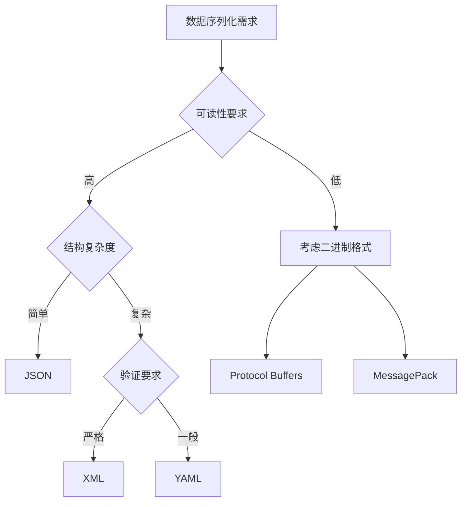

# XML

XML（eXtensible Markup Language，可扩展标记语言）是一种标记语言，广泛用于存储和传输结构化数据。在序列化技术的发展历程中，XML曾经是企业级应用的主流选择，虽然现在逐渐被更轻量级的格式取代，但它在某些特定场景下仍然发挥着重要作用。

## XML的基本格式

XML的语法规则简洁明了，基于标签的嵌套结构来表示数据的层次关系。让我们通过一个用户信息的例子来了解XML的基本格式：

```xml
<?xml version="1.0" encoding="UTF-8"?>
<user>
    <id>1001</id>
    <name>张三</name>
    <email>zhangsan@example.com</email>
    <profile>
        <age>28</age>
        <city>北京</city>
        <hobbies>
            <hobby>读书</hobby>
            <hobby>旅行</hobby>
            <hobby>编程</hobby>
        </hobbies>
    </profile>
</user>
```

这个例子展示了XML的几个关键特征：
- **声明语句**：指定XML版本和字符编码
- **根元素**：整个文档必须有且只有一个根元素
- **嵌套结构**：通过标签的嵌套表示数据的层次关系
- **标签命名**：使用有意义的标签名提高可读性

## XML的核心特点

### 1. 自描述性强

XML最大的优势是其强大的自描述能力。标签名称可以直观地表达数据的含义，即使没有额外的文档说明，也能快速理解数据结构：

```xml
<bookstore>
    <book category="fiction" isbn="978-0-123456-78-9">
        <title>《平凡的世界》</title>
        <author>路遥</author>
        <price currency="CNY">45.00</price>
        <publishDate>1986-12-01</publishDate>
    </book>
</bookstore>
```

### 2. 强大的模式验证

XML支持多种模式定义语言，如DTD（Document Type Definition）和XSD（XML Schema Definition），可以严格控制文档的结构和数据类型：

```xml
<!-- XSD模式示例 -->
<xs:schema xmlns:xs="http://www.w3.org/2001/XMLSchema">
    <xs:element name="user">
        <xs:complexType>
            <xs:sequence>
                <xs:element name="id" type="xs:int"/>
                <xs:element name="name" type="xs:string"/>
                <xs:element name="email" type="xs:string"/>
            </xs:sequence>
        </xs:complexType>
    </xs:element>
</xs:schema>
```

### 3. 丰富的生态系统

XML拥有完善的相关技术栈：
- **XPath**：用于查询和导航XML文档
- **XSLT**：用于XML文档的转换
- **XQuery**：专门的XML查询语言
- **SAX/DOM**：不同的解析方式

## XML的优势与局限

### 优势分析

**1. 标准化程度高**
XML是W3C制定的国际标准，具有广泛的行业认可度。许多企业级标准都基于XML构建，如SOAP、RSS、SVG等。

**2. 平台无关性**
作为纯文本格式，XML可以在任何操作系统、任何编程语言中处理，实现了真正的跨平台数据交换。

**3. 可扩展性强**
通过命名空间机制，可以在同一文档中混合使用不同来源的标签，支持复杂的数据结构设计。

```xml
<document xmlns:book="http://example.com/book"
          xmlns:author="http://example.com/author">
    <book:title>网络编程实战</book:title>
    <author:info>
        <author:name>专家团队</author:name>
    </author:info>
</document>
```

### 局限性分析

**1. 冗余度高**
XML的标签结构导致数据冗余度较高，特别是在标签名较长或嵌套层次较深时：

```xml
<!-- 数据冗余示例 -->
<userContactInformation>
    <personalDetails>
        <fullName>张三</fullName>
        <emailAddress>zhangsan@example.com</emailAddress>
    </personalDetails>
</userContactInformation>
```

相同数据用JSON表示会更简洁：
```json
{
  "user": {
    "name": "张三",
    "email": "zhangsan@example.com"
  }
}
```

**2. 解析开销大**
XML的解析通常需要构建完整的DOM树或者使用复杂的SAX事件处理，消耗较多的内存和CPU资源。

**3. 学习成本高**
XML的相关技术栈庞大，要充分利用XML的特性需要掌握多种相关技术。

## XML的应用场景

### 1. 配置文件管理

许多应用程序使用XML作为配置文件格式，特别是需要复杂结构配置的场景：

```xml
<configuration>
    <database>
        <connection>
            <host>localhost</host>
            <port>3306</port>
            <username>admin</username>
        </connection>
        <pool>
            <minSize>5</minSize>
            <maxSize>20</maxSize>
            <timeout>30000</timeout>
        </pool>
    </database>
</configuration>
```

### 2. 企业级数据交换

在需要严格数据验证和复杂结构的B2B场景中，XML仍然是首选：

```xml
<order xmlns="http://company.com/order/v1">
    <header>
        <orderId>ORD-2024-001</orderId>
        <orderDate>2024-01-15T10:30:00Z</orderDate>
        <customer customerId="C1001"/>
    </header>
    <items>
        <item>
            <sku>PROD-001</sku>
            <quantity>10</quantity>
            <unitPrice>99.99</unitPrice>
        </item>
    </items>
</order>
```

### 3. 文档格式标准

XML是许多文档格式的基础，如Microsoft Office的.docx、.xlsx文件本质上都是XML格式的压缩包。

## 网络通信中的XML处理

在网络编程中使用XML时，需要注意以下关键点：

### 流式处理

对于大型XML文档，建议使用SAX解析器进行流式处理，避免内存溢出：

```python
# Python SAX解析示例
import xml.sax

class UserHandler(xml.sax.ContentHandler):
    def startElement(self, name, attrs):
        if name == "user":
            print(f"开始处理用户: {attrs.get('id', 'unknown')}")

    def characters(self, content):
        if content.strip():
            print(f"内容: {content}")

parser = xml.sax.make_parser()
parser.setContentHandler(UserHandler())
parser.parse("users.xml")
```

### 性能优化策略

**1. 选择合适的解析器**
- DOM解析：适合小文档和需要随机访问的场景
- SAX解析：适合大文档和顺序处理的场景
- StAX解析：拉式解析，提供更好的控制能力

**2. 预编译模式**
对于频繁使用的XML结构，可以预编译XSD模式以提高验证效率。

**3. 缓存策略**
对于结构相同的XML文档，可以缓存解析器实例和模式对象。

## 与其他格式的对比

XML在不同场景下与其他序列化格式的比较：



## 总结

XML作为序列化技术的重要组成部分，虽然在某些方面被更现代的格式所超越，但在特定领域仍然具有不可替代的价值。选择XML时应该考虑：

- **优先场景**：需要严格数据验证、复杂结构表示、标准化要求高的企业级应用
- **避免场景**：对性能要求极高、数据结构简单、移动端应用等场景
- **最佳实践**：合理选择解析策略、做好性能优化、充分利用工具链

理解XML的特点和适用场景，有助于在实际项目中做出更合理的技术选择。

---

*本文档为《网络101》系列的一部分*
