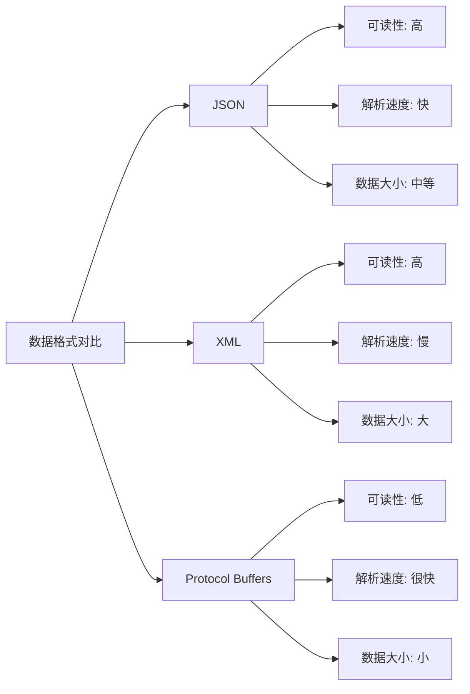

# JSON

JSON（JavaScript Object Notation，JavaScript对象表示法）是一种轻量级的数据交换格式，已经成为现代Web开发和API通信的事实标准。尽管起源于JavaScript，但JSON现在是一种完全独立于语言的数据格式，几乎所有现代编程语言都提供了对JSON的原生支持。

## JSON的基本语法

JSON的语法规则简洁明了，基于两种数据结构：名称/值对的集合（类似于对象、字典、哈希表）和有序的值列表（类似于数组、列表）。

### 基本数据类型

JSON支持六种基本数据类型：

```json
{
  "string": "这是一个字符串",
  "number": 42,
  "boolean": true,
  "null": null,
  "array": [1, 2, 3, "混合数组"],
  "object": {
    "nested": "嵌套对象",
    "count": 100
  }
}
```

### 实际应用示例

让我们通过一个用户信息的完整示例来了解JSON在实际中的应用：

```json
{
  "user": {
    "id": 1001,
    "username": "zhangsan",
    "profile": {
      "firstName": "三",
      "lastName": "张",
      "email": "zhangsan@example.com",
      "age": 28,
      "isVerified": true,
      "avatar": null,
      "tags": ["developer", "blogger", "photographer"],
      "preferences": {
        "language": "zh-CN",
        "timezone": "Asia/Shanghai",
        "notifications": {
          "email": true,
          "push": false
        }
      }
    },
    "metadata": {
      "createdAt": "2024-01-15T08:30:00Z",
      "lastLoginAt": "2024-01-20T14:22:33Z",
      "loginCount": 156
    }
  }
}
```

## JSON的核心优势

### 1. 简洁易读

JSON的语法接近自然语言的表达方式，即使是非技术人员也能快速理解数据结构：

```json
{
  "product": {
    "name": "无线蓝牙耳机",
    "price": 299.99,
    "inStock": true,
    "categories": ["电子产品", "音响设备"],
    "ratings": {
      "average": 4.5,
      "count": 1234
    }
  }
}
```

### 2. 解析效率高

JSON的简单语法使得解析器可以非常高效地处理数据。大多数编程语言都提供了原生的JSON解析支持：

```javascript
// JavaScript - 原生支持
const data = JSON.parse(jsonString);
const jsonString = JSON.stringify(data);
```

```python
# Python - 内置json模块
import json
data = json.loads(json_string)
json_string = json.dumps(data)
```

```go
// Go - 标准库支持
import "encoding/json"
json.Unmarshal([]byte(jsonString), &data)
jsonBytes, _ := json.Marshal(data)
```

### 3. 网络传输友好

JSON作为文本格式，可以直接通过HTTP传输，无需额外的编码转换。这使得它成为RESTful API的理想选择：

```http
POST /api/users HTTP/1.1
Content-Type: application/json

{
  "username": "newuser",
  "email": "newuser@example.com",
  "password": "securepassword123"
}
```

## JSON在Web开发中的应用

### 1. AJAX通信

JSON是AJAX请求的主要数据格式，支持前后端的无缝数据交换：

```javascript
// 前端发送JSON数据
fetch('/api/user/profile', {
  method: 'PUT',
  headers: {
    'Content-Type': 'application/json',
  },
  body: JSON.stringify({
    firstName: '三',
    lastName: '张',
    email: 'zhangsan@example.com'
  })
})
.then(response => response.json())
.then(data => {
  console.log('更新成功:', data);
});
```

### 2. 配置文件

许多现代应用使用JSON作为配置文件格式，特别是Node.js生态：

```json
{
  "name": "my-web-app",
  "version": "1.0.0",
  "description": "一个现代化的Web应用",
  "main": "index.js",
  "scripts": {
    "start": "node index.js",
    "test": "jest",
    "build": "webpack --mode=production"
  },
  "dependencies": {
    "express": "^4.18.0",
    "mongoose": "^6.0.0"
  },
  "devDependencies": {
    "jest": "^27.0.0",
    "webpack": "^5.0.0"
  }
}
```

### 3. 数据存储

许多NoSQL数据库（如MongoDB）原生支持JSON格式的文档存储：

```json
{
  "_id": "507f1f77bcf86cd799439011",
  "title": "网络编程入门指南",
  "author": {
    "name": "张三",
    "email": "zhangsan@example.com"
  },
  "content": "这是一篇关于网络编程的文章...",
  "tags": ["网络", "编程", "教程"],
  "publishedAt": "2024-01-15T10:30:00Z",
  "stats": {
    "views": 1250,
    "likes": 89,
    "comments": 23
  }
}
```

## JSON的局限性

### 1. 数据类型限制

JSON只支持有限的数据类型，不支持日期、二进制数据、函数等复杂类型：

```json
{
  "date": "2024-01-15T10:30:00Z",  // 日期必须用字符串表示
  "binary": "base64EncodedData",   // 二进制数据需要编码
  "comment": "不支持注释"           // JSON原生不支持注释
}
```

### 2. 数据冗余

对于大量重复结构的数据，JSON会产生显著的数据冗余：

```json
{
  "users": [
    {
      "id": 1,
      "firstName": "张",
      "lastName": "三",
      "department": "技术部",
      "company": "ABC科技有限公司"
    },
    {
      "id": 2,
      "firstName": "李",
      "lastName": "四",
      "department": "技术部",     // 重复信息
      "company": "ABC科技有限公司"  // 重复信息
    }
  ]
}
```

### 3. 精度问题

JSON的数字类型基于IEEE 754双精度浮点数，在处理大整数时可能出现精度丢失：

```javascript
// JavaScript中的精度问题
console.log(9007199254740992 === 9007199254740993); // true，应该是false
```

## JSON处理的最佳实践

### 1. 错误处理

在解析JSON时，必须进行适当的错误处理：

```python
import json

def safe_json_parse(json_string):
    try:
        return json.loads(json_string)
    except json.JSONDecodeError as e:
        print(f"JSON解析错误: {e}")
        return None

# 使用示例
data = safe_json_parse('{"invalid": json}')  # 返回None
```

### 2. 数据验证

对接收到的JSON数据进行结构和类型验证：

```python
def validate_user_data(data):
    required_fields = ['username', 'email', 'age']

    if not isinstance(data, dict):
        return False, "数据必须是对象"

    for field in required_fields:
        if field not in data:
            return False, f"缺少必要字段: {field}"

    if not isinstance(data['age'], int) or data['age'] < 0:
        return False, "年龄必须是非负整数"

    return True, "验证通过"
```

### 3. 性能优化

对于大型JSON数据，考虑使用流式解析或分块处理：

```python
import ijson  # 流式JSON解析库

def parse_large_json_stream(file_path):
    with open(file_path, 'rb') as file:
        # 只解析需要的字段
        for user in ijson.items(file, 'users.item'):
            print(f"处理用户: {user['username']}")
            # 逐个处理，不需要加载整个文件到内存
```

## JSON与其他格式的性能对比



## 实际应用场景分析

### RESTful API

JSON是RESTful API的标准数据格式：

```http
GET /api/v1/users/1001
Accept: application/json

HTTP/1.1 200 OK
Content-Type: application/json

{
  "id": 1001,
  "username": "zhangsan",
  "profile": {
    "email": "zhangsan@example.com",
    "createdAt": "2024-01-15T08:30:00Z"
  },
  "links": {
    "self": "/api/v1/users/1001",
    "posts": "/api/v1/users/1001/posts"
  }
}
```

### 微服务通信

在微服务架构中，JSON便于服务间的数据交换：

```json
{
  "serviceRequest": {
    "requestId": "req-123456",
    "timestamp": "2024-01-20T14:30:00Z",
    "service": "user-service",
    "operation": "getUserProfile",
    "parameters": {
      "userId": 1001,
      "includePreferences": true
    }
  }
}
```

### 日志记录

结构化日志通常使用JSON格式便于分析和处理：

```json
{
  "timestamp": "2024-01-20T14:30:15.123Z",
  "level": "INFO",
  "service": "api-gateway",
  "requestId": "req-789012",
  "message": "Request processed successfully",
  "details": {
    "method": "GET",
    "path": "/api/users/1001",
    "statusCode": 200,
    "responseTime": 45,
    "userAgent": "Mozilla/5.0..."
  }
}
```

## 总结

JSON以其简洁、易读、高效的特点，成为了现代网络通信和数据交换的主流格式。它的成功在于找到了可读性、性能和易用性之间的最佳平衡点。

**选择JSON的场景：**
- Web API开发和前后端数据交换
- 配置文件和设置存储
- 轻量级数据存储和传输
- 日志记录和数据分析

**避免JSON的场景：**
- 对数据大小极度敏感的场景
- 需要复杂数据类型（如二进制数据）的场景
- 对解析性能有极高要求的场景

理解JSON的特点和适用场景，能够帮助我们在构建现代网络应用时做出最合适的技术选择。

---

*本文档为《网络101》系列的一部分*
