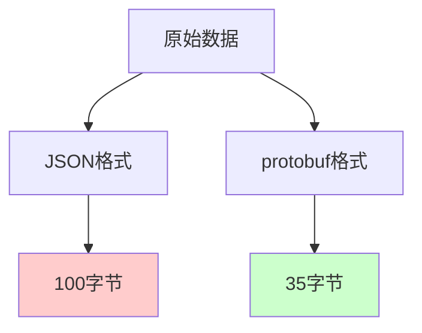

# Protocol Buffers

Protocol Buffers（简称protobuf）是Google开发的一种语言无关、平台无关的序列化数据结构的方法。它被设计为比XML更小、更快、更简单的数据交换格式，同时在保持强大功能的基础上实现了极高的性能。在现代的微服务架构和高性能系统中，protobuf已经成为首选的序列化方案之一。

## protobuf的核心设计理念

### 1. 向后兼容的模式演进

protobuf最重要的特性之一是支持模式的向前和向后兼容。这意味着你可以更新数据结构定义，而不会破坏现有的代码：

```protobuf
// 版本1 - 原始定义
syntax = "proto3";

message User {
  int32 id = 1;
  string name = 2;
  string email = 3;
}

// 版本2 - 添加新字段
message User {
  int32 id = 1;
  string name = 2;
  string email = 3;
  int32 age = 4;        // 新增字段
  repeated string tags = 5;  // 新增数组字段
}
```

### 2. 高效的二进制编码

与文本格式不同，protobuf使用紧凑的二进制格式存储数据，大大减少了存储空间和传输带宽：



### 3. 强类型系统

protobuf提供了严格的类型系统，在编译时就能发现数据类型错误，提高了系统的可靠性。

## protobuf的基本语法

### 定义消息结构

protobuf使用.proto文件定义数据结构，语法简洁明了：

```protobuf
syntax = "proto3";

package network101.example;

// 用户信息
message UserProfile {
  // 基本信息
  int32 user_id = 1;
  string username = 2;
  string email = 3;
  bool is_verified = 4;

  // 嵌套消息
  PersonalInfo personal = 5;

  // 数组字段
  repeated string interests = 6;

  // 映射字段
  map<string, string> metadata = 7;

  // 枚举类型
  Status status = 8;
}

// 嵌套消息定义
message PersonalInfo {
  string first_name = 1;
  string last_name = 2;
  int32 age = 3;
  string city = 4;
}

// 枚举定义
enum Status {
  UNKNOWN = 0;
  ACTIVE = 1;
  INACTIVE = 2;
  SUSPENDED = 3;
}
```

### 字段编号的重要性

每个字段都有一个唯一的编号，这个编号在二进制格式中用于标识字段，因此一旦确定就不应该改变：

```protobuf
message Example {
  string name = 1;    // 编号1，永远不变
  int32 value = 2;    // 编号2，永远不变
  // string old_field = 3;  // 已废弃，编号3保留，不能重用
  string new_field = 4;     // 新字段使用新编号
}
```

## 代码生成和使用

### 生成代码

使用protoc编译器生成目标语言的代码：

```bash
# 生成Python代码
protoc --python_out=./generated user_profile.proto

# 生成Go代码
protoc --go_out=./generated user_profile.proto

# 生成Java代码
protoc --java_out=./generated user_profile.proto
```

### Python中的使用示例

```python
# 导入生成的代码
from generated import user_profile_pb2

# 创建消息对象
user = user_profile_pb2.UserProfile()
user.user_id = 1001
user.username = "zhangsan"
user.email = "zhangsan@example.com"
user.is_verified = True

# 设置嵌套对象
user.personal.first_name = "三"
user.personal.last_name = "张"
user.personal.age = 28
user.personal.city = "北京"

# 添加数组元素
user.interests.extend(["编程", "旅行", "摄影"])

# 设置映射字段
user.metadata["last_login"] = "2024-01-20"
user.metadata["device"] = "mobile"

# 设置枚举值
user.status = user_profile_pb2.Status.ACTIVE

# 序列化为二进制
serialized_data = user.SerializeToString()

# 反序列化
new_user = user_profile_pb2.UserProfile()
new_user.ParseFromString(serialized_data)

print(f"用户名: {new_user.username}")
print(f"兴趣: {list(new_user.interests)}")
```

### Go中的使用示例

```go
package main

import (
    "fmt"
    "log"

    "google.golang.org/protobuf/proto"
    pb "path/to/generated/user_profile"
)

func main() {
    // 创建用户对象
    user := &pb.UserProfile{
        UserId:     1001,
        Username:   "zhangsan",
        Email:      "zhangsan@example.com",
        IsVerified: true,
        Personal: &pb.PersonalInfo{
            FirstName: "三",
            LastName:  "张",
            Age:       28,
            City:      "北京",
        },
        Interests: []string{"编程", "旅行", "摄影"},
        Metadata: map[string]string{
            "last_login": "2024-01-20",
            "device":     "mobile",
        },
        Status: pb.Status_ACTIVE,
    }

    // 序列化
    data, err := proto.Marshal(user)
    if err != nil {
        log.Fatal("序列化失败:", err)
    }

    // 反序列化
    newUser := &pb.UserProfile{}
    err = proto.Unmarshal(data, newUser)
    if err != nil {
        log.Fatal("反序列化失败:", err)
    }

    fmt.Printf("用户名: %s\n", newUser.Username)
    fmt.Printf("兴趣: %v\n", newUser.Interests)
}
```

## protobuf的高级特性

### 1. 服务定义（gRPC）

protobuf可以定义服务接口，配合gRPC实现高性能的RPC通信：

```protobuf
syntax = "proto3";

service UserService {
  // 获取用户信息
  rpc GetUser(GetUserRequest) returns (UserProfile);

  // 更新用户信息
  rpc UpdateUser(UpdateUserRequest) returns (UpdateUserResponse);

  // 流式获取用户列表
  rpc ListUsers(ListUsersRequest) returns (stream UserProfile);
}

message GetUserRequest {
  int32 user_id = 1;
}

message UpdateUserRequest {
  int32 user_id = 1;
  UserProfile user = 2;
}

message UpdateUserResponse {
  bool success = 1;
  string message = 2;
}

message ListUsersRequest {
  int32 page_size = 1;
  string page_token = 2;
}
```

### 2. 字段选项和验证

可以为字段添加选项和验证规则：

```protobuf
import "google/protobuf/field_mask.proto";
import "validate/validate.proto";

message User {
  int32 id = 1 [(validate.rules).int32.gt = 0];

  string email = 2 [(validate.rules).string = {
    pattern: "^[a-zA-Z0-9._%+-]+@[a-zA-Z0-9.-]+\\.[a-zA-Z]{2,}$"
  }];

  string username = 3 [(validate.rules).string = {
    min_len: 3,
    max_len: 20
  }];

  google.protobuf.FieldMask field_mask = 4;
}
```

### 3. Any类型和动态消息

protobuf支持Any类型来存储任意类型的消息：

```protobuf
import "google/protobuf/any.proto";

message FlexibleMessage {
  string type = 1;
  google.protobuf.Any payload = 2;
}
```

## 性能特性分析

### 编码效率

protobuf使用变长编码（varint）来压缩整数，使用字典压缩来减少字符串重复：

```python
# 性能测试示例
import time
import json
from generated import user_profile_pb2

# 创建测试数据
users_json = []
users_protobuf = []

for i in range(10000):
    # JSON数据
    user_json = {
        "user_id": i,
        "username": f"user_{i}",
        "email": f"user_{i}@example.com",
        "interests": ["编程", "旅行", "摄影"]
    }
    users_json.append(user_json)

    # protobuf数据
    user_pb = user_profile_pb2.UserProfile()
    user_pb.user_id = i
    user_pb.username = f"user_{i}"
    user_pb.email = f"user_{i}@example.com"
    user_pb.interests.extend(["编程", "旅行", "摄影"])
    users_protobuf.append(user_pb)

# JSON序列化测试
start = time.time()
json_data = json.dumps(users_json, ensure_ascii=False)
json_serialize_time = time.time() - start

# protobuf序列化测试
start = time.time()
protobuf_data = b''.join(user.SerializeToString() for user in users_protobuf)
protobuf_serialize_time = time.time() - start

print(f"JSON大小: {len(json_data.encode('utf-8'))} bytes")
print(f"protobuf大小: {len(protobuf_data)} bytes")
print(f"JSON序列化时间: {json_serialize_time:.4f}s")
print(f"protobuf序列化时间: {protobuf_serialize_time:.4f}s")
```

### 内存使用优化

protobuf在内存使用方面也进行了优化，支持延迟解析和零拷贝操作：

```cpp
// C++中的零拷贝解析
std::string serialized_data = GetSerializedData();

// 使用Cord进行零拷贝解析
google::protobuf::io::StringInputStream stream(serialized_data);
UserProfile user;
user.ParseFromZeroCopyStream(&stream);
```

## 实际应用场景

### 1. 微服务通信

在微服务架构中，protobuf结合gRPC提供了高效的服务间通信：

```protobuf
// 订单服务定义
service OrderService {
  rpc CreateOrder(CreateOrderRequest) returns (Order);
  rpc GetOrder(GetOrderRequest) returns (Order);
  rpc UpdateOrderStatus(UpdateOrderStatusRequest) returns (Order);
}

message Order {
  string order_id = 1;
  int32 user_id = 2;
  repeated OrderItem items = 3;
  OrderStatus status = 4;
  int64 created_at = 5;
  int64 updated_at = 6;
}

message OrderItem {
  string product_id = 1;
  int32 quantity = 2;
  double price = 3;
}

enum OrderStatus {
  PENDING = 0;
  CONFIRMED = 1;
  SHIPPED = 2;
  DELIVERED = 3;
  CANCELLED = 4;
}
```

### 2. 消息队列

protobuf适合用作消息队列的消息格式，提供高性能的消息序列化：

```protobuf
// 事件消息定义
message Event {
  string event_id = 1;
  string event_type = 2;
  int64 timestamp = 3;
  string source = 4;
  google.protobuf.Any payload = 5;
}

// 用户注册事件
message UserRegisteredEvent {
  int32 user_id = 1;
  string username = 2;
  string email = 3;
  int64 registered_at = 4;
}
```

### 3. 数据存储

许多数据库和存储系统使用protobuf作为内部数据格式：

```protobuf
// 数据库记录格式
message DatabaseRecord {
  string table_name = 1;
  string primary_key = 2;
  map<string, Value> fields = 3;
  int64 version = 4;
  int64 created_at = 5;
  int64 updated_at = 6;
}

message Value {
  oneof value_type {
    string string_value = 1;
    int64 int_value = 2;
    double double_value = 3;
    bool bool_value = 4;
    bytes bytes_value = 5;
  }
}
```

## 最佳实践

### 1. 模式设计原则

- **保留字段编号**：删除字段时保留编号，避免重用
- **使用optional语义**：proto3中所有字段默认是optional的
- **合理嵌套**：避免过深的嵌套结构
- **版本管理**：为模式文件建立版本管理机制

### 2. 性能优化技巧

```python
# 重用消息对象
user_pool = []

def get_user_message():
    if user_pool:
        user = user_pool.pop()
        user.Clear()  # 清空数据
        return user
    return user_profile_pb2.UserProfile()

def return_user_message(user):
    user_pool.append(user)

# 批量序列化
def serialize_users_batch(users):
    buffer = []
    for user in users:
        buffer.append(user.SerializeToString())
    return b''.join(buffer)
```

### 3. 错误处理

```python
from google.protobuf.message import DecodeError

def safe_parse_user(data):
    try:
        user = user_profile_pb2.UserProfile()
        user.ParseFromString(data)
        return user, None
    except DecodeError as e:
        return None, f"解析失败: {e}"

# 使用示例
user, error = safe_parse_user(received_data)
if error:
    print(f"错误: {error}")
else:
    print(f"用户: {user.username}")
```

## 总结

Protocol Buffers作为高性能序列化解决方案，在以下场景中表现优异：

**优势：**
- 体积小、速度快、性能优秀
- 强类型系统，编译时错误检查
- 良好的向前/向后兼容性
- 丰富的语言支持和工具链
- 支持代码生成，开发效率高

**适用场景：**
- 微服务间的高频通信
- 对性能要求严格的系统
- 需要严格类型检查的场景
- 大数据量的存储和传输

**不适用场景：**
- 需要人类可读的调试信息
- 简单的配置文件和设置
- 一次性的数据交换

理解protobuf的原理和最佳实践，有助于在构建高性能网络应用时做出正确的技术选择。

---

*本文档为《网络101》系列的一部分*
