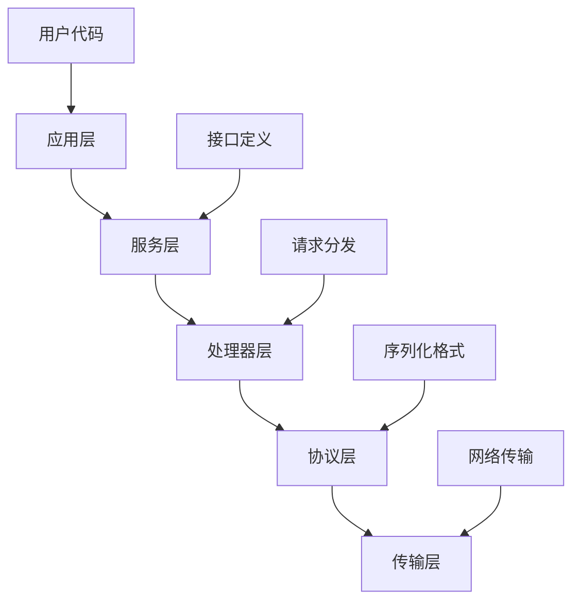
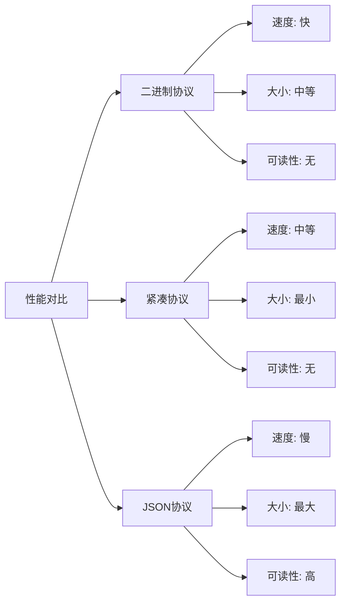
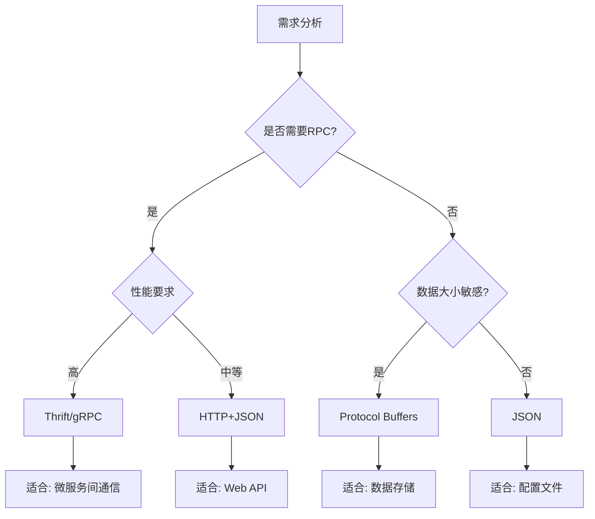

# Apache Thrift

Apache Thrift是Facebook开源的一种跨语言服务开发框架，它结合了功能强大的软件栈和代码生成引擎，可以高效地构建在C++、Java、Python、PHP、Ruby、Erlang、Perl、Haskell、C#、Cocoa、JavaScript、Node.js、Smalltalk、OCaml和Delphi等编程语言间无缝工作的服务。与protobuf专注于序列化不同，Thrift提供了完整的RPC解决方案。

## Thrift的架构设计

### 分层架构

Thrift采用了分层的架构设计，每一层都有明确的职责：



### 核心组件

**1. IDL（Interface Definition Language）**
Thrift使用IDL来定义数据类型和服务接口，支持多种编程语言的代码生成。

**2. 传输层（Transport Layer）**
负责数据的读写，支持文件、内存、网络等多种传输方式。

**3. 协议层（Protocol Layer）**
定义数据序列化和反序列化的格式，支持二进制、JSON等多种协议。

**4. 处理器（Processor）**
将协议层的数据转换为函数调用，实现具体的业务逻辑。

## Thrift IDL语法

### 基本数据类型

Thrift支持丰富的数据类型，涵盖了大多数编程语言的基本类型：

```thrift
// 基本类型
bool boolean_value
byte byte_value
i16 short_value
i32 int_value
i64 long_value
double double_value
string string_value
binary binary_value

// 容器类型
list<i32> int_list
set<string> string_set
map<string, i32> string_int_map

// 自定义类型
typedef i32 UserId
typedef string UserName
```

### 结构体定义

Thrift使用struct关键字定义结构化数据：

```thrift
// 用户信息结构体
struct UserProfile {
  1: required i32 user_id,
  2: required string username,
  3: optional string email,
  4: optional i32 age,
  5: optional list<string> interests,
  6: optional map<string, string> metadata
}

// 嵌套结构体
struct Address {
  1: string street,
  2: string city,
  3: string country,
  4: string postal_code
}

struct UserDetail {
  1: UserProfile profile,
  2: Address address,
  3: bool is_verified = false
}
```

### 枚举类型

```thrift
enum UserStatus {
  UNKNOWN = 0,
  ACTIVE = 1,
  INACTIVE = 2,
  SUSPENDED = 3,
  DELETED = 4
}

struct User {
  1: i32 id,
  2: string name,
  3: UserStatus status = UserStatus.ACTIVE
}
```

### 异常定义

Thrift支持定义自定义异常：

```thrift
exception UserNotFoundException {
  1: string message,
  2: i32 error_code
}

exception ValidationException {
  1: string field_name,
  2: string error_message
}
```

### 服务接口定义

Thrift的核心特性是服务定义，允许定义RPC接口：

```thrift
service UserService {
  // 基本操作
  UserProfile getUser(1: i32 user_id) throws (1: UserNotFoundException ex),

  // 创建用户
  i32 createUser(1: UserProfile profile) throws (1: ValidationException ex),

  // 更新用户
  void updateUser(1: i32 user_id, 2: UserProfile profile)
    throws (1: UserNotFoundException not_found, 2: ValidationException validation),

  // 批量操作
  list<UserProfile> getUsers(1: list<i32> user_ids),

  // 单向调用（无返回值，不等待响应）
  oneway void logUserActivity(1: i32 user_id, 2: string activity)
}
```

## 代码生成和使用

### 生成代码

使用thrift编译器生成目标语言的代码：

```bash
# 生成Python代码
thrift --gen py user_service.thrift

# 生成Java代码
thrift --gen java user_service.thrift

# 生成Go代码
thrift --gen go user_service.thrift

# 生成C++代码
thrift --gen cpp user_service.thrift
```

### Python服务端实现

```python
# 导入生成的代码
from user_service import UserService
from user_service.ttypes import *

from thrift.transport import TSocket, TTransport
from thrift.protocol import TBinaryProtocol
from thrift.server import TServer

class UserServiceHandler:
    def __init__(self):
        self.users = {}
        self.next_id = 1

    def getUser(self, user_id):
        if user_id not in self.users:
            raise UserNotFoundException(
                message=f"User {user_id} not found",
                error_code=404
            )
        return self.users[user_id]

    def createUser(self, profile):
        # 验证用户数据
        if not profile.username:
            raise ValidationException(
                field_name="username",
                error_message="Username is required"
            )

        user_id = self.next_id
        self.next_id += 1

        # 创建完整的用户信息
        user_profile = UserProfile(
            user_id=user_id,
            username=profile.username,
            email=profile.email,
            age=profile.age,
            interests=profile.interests or [],
            metadata=profile.metadata or {}
        )

        self.users[user_id] = user_profile
        return user_id

    def updateUser(self, user_id, profile):
        if user_id not in self.users:
            raise UserNotFoundException(
                message=f"User {user_id} not found",
                error_code=404
            )

        # 更新用户信息
        self.users[user_id] = profile

    def getUsers(self, user_ids):
        result = []
        for user_id in user_ids:
            if user_id in self.users:
                result.append(self.users[user_id])
        return result

    def logUserActivity(self, user_id, activity):
        # 异步日志记录，不返回结果
        print(f"User {user_id} activity: {activity}")

# 启动服务器
def start_server():
    handler = UserServiceHandler()
    processor = UserService.Processor(handler)

    transport = TSocket.TServerSocket(host='localhost', port=9090)
    tfactory = TTransport.TBufferedTransportFactory()
    pfactory = TBinaryProtocol.TBinaryProtocolFactory()

    server = TServer.TSimpleServer(processor, transport, tfactory, pfactory)
    print("Starting server on localhost:9090")
    server.serve()

if __name__ == '__main__':
    start_server()
```

### Python客户端实现

```python
from user_service import UserService
from user_service.ttypes import *

from thrift.transport import TSocket, TTransport
from thrift.protocol import TBinaryProtocol

def create_client():
    # 创建传输连接
    transport = TSocket.TSocket('localhost', 9090)
    transport = TTransport.TBufferedTransport(transport)

    # 创建协议
    protocol = TBinaryProtocol.TBinaryProtocol(transport)

    # 创建客户端
    client = UserService.Client(protocol)

    # 打开连接
    transport.open()

    return client, transport

def main():
    client, transport = create_client()

    try:
        # 创建用户
        profile = UserProfile(
            username="zhangsan",
            email="zhangsan@example.com",
            age=28,
            interests=["编程", "旅行"],
            metadata={"location": "北京"}
        )

        user_id = client.createUser(profile)
        print(f"Created user with ID: {user_id}")

        # 获取用户信息
        user = client.getUser(user_id)
        print(f"Retrieved user: {user.username}")

        # 批量获取用户
        users = client.getUsers([user_id])
        print(f"Batch retrieved {len(users)} users")

        # 记录用户活动（单向调用）
        client.logUserActivity(user_id, "login")

    except UserNotFoundException as e:
        print(f"User not found: {e.message}")
    except ValidationException as e:
        print(f"Validation error in {e.field_name}: {e.error_message}")
    finally:
        transport.close()

if __name__ == '__main__':
    main()
```

## Thrift的协议和传输选项

### 协议选择

Thrift支持多种序列化协议：

```python
from thrift.protocol import TBinaryProtocol, TJSONProtocol, TCompactProtocol

# 二进制协议 - 性能最好
binary_protocol = TBinaryProtocol.TBinaryProtocol(transport)

# JSON协议 - 人类可读
json_protocol = TJSONProtocol.TJSONProtocol(transport)

# 紧凑协议 - 体积最小
compact_protocol = TCompactProtocol.TCompactProtocol(transport)
```

### 传输方式

```python
from thrift.transport import TSocket, TTransport, THttpClient

# TCP Socket传输
socket_transport = TSocket.TSocket('localhost', 9090)

# HTTP传输
http_transport = THttpClient.THttpClient('http://localhost:8080/service')

# 缓冲传输（推荐）
buffered_transport = TTransport.TBufferedTransport(socket_transport)

# 帧传输（用于非阻塞服务器）
framed_transport = TTransport.TFramedTransport(socket_transport)
```

### 服务器类型

```python
from thrift.server import TServer

# 简单服务器（单线程）
simple_server = TServer.TSimpleServer(processor, transport, tfactory, pfactory)

# 线程池服务器
thread_server = TServer.TThreadPoolServer(processor, transport, tfactory, pfactory)

# 线程服务器（每个连接一个线程）
threaded_server = TServer.TThreadedServer(processor, transport, tfactory, pfactory)
```

## 性能特性分析

### 协议性能对比

不同协议在序列化性能和数据大小方面的表现：



### 性能测试示例

```python
import time
import json
from user_service.ttypes import UserProfile

def performance_test():
    # 创建测试数据
    users = []
    for i in range(10000):
        user = UserProfile(
            user_id=i,
            username=f"user_{i}",
            email=f"user_{i}@example.com",
            age=25 + i % 50,
            interests=["编程", "旅行", "摄影"],
            metadata={"created": "2024-01-01"}
        )
        users.append(user)

    # Thrift二进制序列化测试
    from thrift.protocol import TBinaryProtocol
    from thrift.transport import TTransport

    transport = TTransport.TMemoryBuffer()
    protocol = TBinaryProtocol.TBinaryProtocol(transport)

    start = time.time()
    for user in users:
        user.write(protocol)
    thrift_time = time.time() - start
    thrift_size = len(transport.getvalue())

    # JSON序列化测试（对比）
    start = time.time()
    json_data = json.dumps([{
        'user_id': u.user_id,
        'username': u.username,
        'email': u.email,
        'age': u.age,
        'interests': u.interests,
        'metadata': u.metadata
    } for u in users], ensure_ascii=False)
    json_time = time.time() - start
    json_size = len(json_data.encode('utf-8'))

    print(f"Thrift序列化时间: {thrift_time:.4f}s, 大小: {thrift_size} bytes")
    print(f"JSON序列化时间: {json_time:.4f}s, 大小: {json_size} bytes")
    print(f"Thrift比JSON快 {json_time/thrift_time:.2f}倍")
    print(f"Thrift比JSON小 {json_size/thrift_size:.2f}倍")

if __name__ == '__main__':
    performance_test()
```

## 与其他序列化技术的对比

### 功能对比

| 特性 | Thrift | Protocol Buffers | JSON | XML |
|------|--------|------------------|------|-----|
| 序列化性能 | 高 | 很高 | 中等 | 低 |
| 数据大小 | 小 | 很小 | 中等 | 大 |
| 可读性 | 低 | 低 | 高 | 高 |
| 语言支持 | 广泛 | 广泛 | 通用 | 通用 |
| RPC支持 | 内置 | 需gRPC | 需HTTP | 需SOAP |
| 学习成本 | 中等 | 中等 | 低 | 中等 |

### 选择建议



## 实际应用场景

### 微服务架构

Thrift在微服务架构中提供了完整的服务治理解决方案：

```thrift
// 订单服务
service OrderService {
  Order createOrder(1: CreateOrderRequest request),
  Order getOrder(1: string order_id),
  list<Order> getUserOrders(1: i32 user_id),
  void cancelOrder(1: string order_id)
}

// 支付服务
service PaymentService {
  PaymentResult processPayment(1: PaymentRequest request),
  PaymentStatus getPaymentStatus(1: string payment_id),
  void refundPayment(1: string payment_id)
}

// 用户服务
service UserService {
  User getUser(1: i32 user_id),
  User updateUser(1: User user),
  bool validateUser(1: string username, 2: string password)
}
```

### 分布式系统

在分布式系统中，Thrift提供了可靠的跨节点通信机制：

```python
# 服务发现和负载均衡
class ThriftServicePool:
    def __init__(self, service_class, servers):
        self.service_class = service_class
        self.servers = servers
        self.current = 0

    def get_client(self):
        server = self.servers[self.current % len(self.servers)]
        self.current += 1

        transport = TSocket.TSocket(server['host'], server['port'])
        transport = TTransport.TBufferedTransport(transport)
        protocol = TBinaryProtocol.TBinaryProtocol(transport)

        client = self.service_class.Client(protocol)
        transport.open()

        return client, transport

# 使用示例
servers = [
    {'host': 'node1.example.com', 'port': 9090},
    {'host': 'node2.example.com', 'port': 9090},
    {'host': 'node3.example.com', 'port': 9090},
]

service_pool = ThriftServicePool(UserService, servers)
client, transport = service_pool.get_client()

try:
    user = client.getUser(1001)
    print(f"Got user: {user.username}")
finally:
    transport.close()
```

## 最佳实践

### 1. IDL设计原则

- **向后兼容性**：添加字段时使用新的字段ID，不要修改已有字段
- **字段标记**：合理使用required、optional和默认值
- **命名规范**：使用清晰、一致的命名约定
- **版本管理**：为IDL文件建立版本控制

### 2. 错误处理策略

```thrift
// 定义分层的异常体系
exception ServiceException {
  1: i32 code,
  2: string message,
  3: optional string details
}

exception BusinessException extends ServiceException {
  1: string business_code
}

exception SystemException extends ServiceException {
  1: string system_error
}

service RobustService {
  Response processRequest(1: Request request)
    throws (1: BusinessException business_error,
            2: SystemException system_error)
}
```

### 3. 性能优化

```python
# 连接池管理
import threading
from queue import Queue

class ThriftConnectionPool:
    def __init__(self, service_class, host, port, max_connections=10):
        self.service_class = service_class
        self.host = host
        self.port = port
        self.pool = Queue(maxsize=max_connections)
        self.lock = threading.Lock()

        # 预创建连接
        for _ in range(max_connections):
            conn = self._create_connection()
            self.pool.put(conn)

    def _create_connection(self):
        transport = TSocket.TSocket(self.host, self.port)
        transport = TTransport.TBufferedTransport(transport)
        protocol = TBinaryProtocol.TBinaryProtocol(transport)
        client = self.service_class.Client(protocol)
        transport.open()
        return client, transport

    def get_connection(self):
        return self.pool.get()

    def return_connection(self, conn):
        self.pool.put(conn)
```

## 总结

Apache Thrift作为完整的RPC框架，在以下方面表现突出：

**优势：**
- 完整的RPC解决方案，包含序列化和服务调用
- 多语言支持，适合异构系统
- 灵活的协议和传输选择
- 成熟的生态系统和工具链
- 良好的性能表现

**适用场景：**
- 微服务架构中的服务间通信
- 分布式系统的RPC调用
- 需要跨语言交互的场景
- 对性能有较高要求的系统

**不适用场景：**
- 简单的配置文件和数据存储
- 需要人类可读格式的场景
- 对二进制格式有限制的环境

理解Thrift的特点和使用方法，有助于在构建分布式系统时选择合适的通信方案。

---

*本文档为《网络101》系列的一部分*
