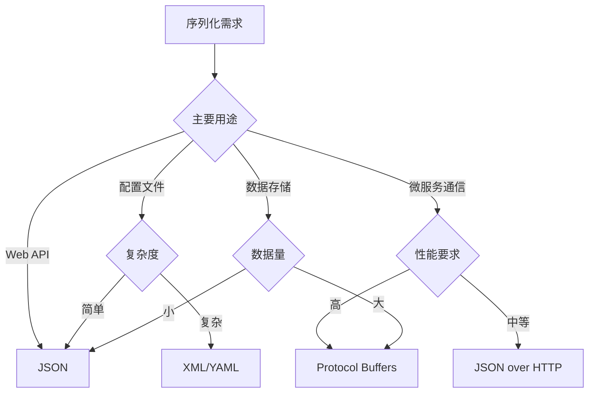

# 小结

通过本章的学习，我们深入探讨了网络通信中序列化和反序列化的核心概念、主要技术方案以及实际应用场景。序列化技术作为现代网络应用的基石，在系统设计和性能优化中发挥着至关重要的作用。

## 核心概念回顾

**序列化的本质**
序列化是将内存中的复杂数据结构转换为可传输、可存储格式的过程，而反序列化则是其逆过程。这个转换过程解决了网络只能传输字节流，而程序需要处理复杂对象的根本矛盾。

**关键考量因素**
在选择序列化方案时，需要综合考虑性能（序列化速度、数据大小）、兼容性（跨语言、版本演进）、可读性（调试、维护）和功能特性（类型安全、模式验证）等多个维度。

## 技术方案对比

### 文本格式：可读性优先

**JSON**：现代Web开发的主流选择
- 优势：语法简洁、可读性强、语言支持广泛、解析效率高
- 适用场景：Web API、配置文件、轻量级数据交换
- 局限性：数据类型有限、不支持注释、对大数据量效率一般

**XML**：企业级应用的传统选择
- 优势：功能强大、标准化程度高、支持复杂验证、工具链完善
- 适用场景：企业级数据交换、配置管理、文档格式标准
- 局限性：体积大、解析开销高、语法相对复杂

### 二进制格式：性能优先

**Protocol Buffers**：高性能序列化的标杆
- 优势：体积小、速度快、强类型、向后兼容性好
- 适用场景：微服务通信、高性能系统、大数据传输
- 局限性：不可读、需要预定义模式、学习成本较高

**Apache Thrift**：全栈RPC解决方案
- 优势：内置RPC支持、多语言支持、灵活的传输协议
- 适用场景：分布式系统、跨语言服务调用、企业级应用
- 局限性：相对复杂、社区生态不如gRPC活跃

## 选择决策指南

### 基于应用场景的选择



### 性能与可读性权衡

**高性能场景**：优先选择二进制格式
- 微服务间高频通信：Protocol Buffers + gRPC
- 大数据量传输：Apache Avro、MessagePack
- 实时系统：定制化二进制协议

**开发效率优先**：选择文本格式
- 快速原型开发：JSON
- 调试和测试：JSON/XML
- 配置管理：JSON/YAML

**企业级应用**：考虑长期维护
- 严格类型检查：Protocol Buffers、Thrift
- 版本兼容性：Protocol Buffers、Avro
- 标准化要求：XML、JSON Schema

## 实践建议

### 1. 渐进式优化策略

在项目初期，可以从简单易用的JSON开始，随着系统复杂度和性能要求的提升，逐步迁移到更高效的二进制格式：

```
开发阶段：JSON（快速迭代）
↓
测试阶段：JSON + 性能测试
↓
生产阶段：根据瓶颈选择优化方案
```

### 2. 混合使用策略

在复杂系统中，不同场景可以使用不同的序列化方案：
- 外部API：JSON（兼容性好）
- 内部服务：Protocol Buffers（性能优）
- 配置文件：YAML（可读性强）
- 日志记录：JSON（便于分析）

### 3. 性能优化要点

**减少序列化开销**
- 使用对象池避免频繁创建对象
- 批量处理减少序列化次数
- 选择合适的缓冲区大小

**优化数据结构**
- 避免深层嵌套结构
- 合理使用可选字段
- 考虑数据压缩的收益

## 未来发展趋势

**标准化趋势**
JSON Schema、OpenAPI等标准的普及，使得文本格式也能获得类型安全和文档化的优势。

**性能优化**
新一代序列化技术如FlatBuffers、Cap'n Proto等，在保持高性能的同时提供更好的易用性。

**云原生适配**
序列化技术与容器化、服务网格等云原生技术的深度集成，提供更好的可观测性和治理能力。

## 总结

序列化技术的选择没有银弹，需要根据具体的应用场景、性能要求和团队能力来综合决策。理解各种技术的特点和适用场景，能够帮助我们在构建现代网络应用时做出最合适的技术选择。

关键是要在项目的不同阶段保持灵活性，既要满足当前的功能需求，也要为未来的扩展和优化留出空间。通过合理的技术选型和架构设计，序列化技术将成为构建高效、可靠网络应用的有力工具。

---

*本文档为《网络101》系列的一部分*
