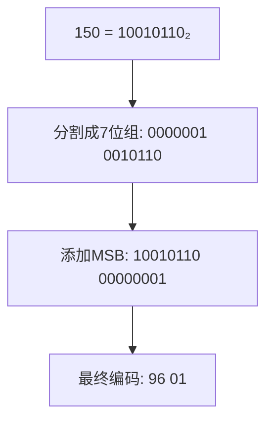
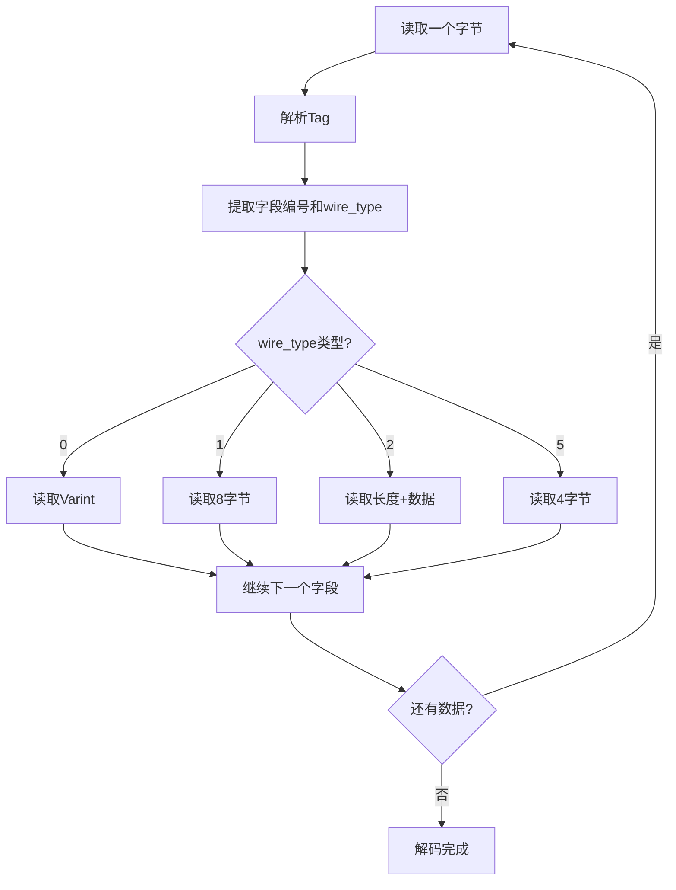

# protobuf怎样组织基础数据

当我们在网络抓包时看到protobuf数据时，往往会被一堆看似杂乱的二进制数据所困惑。这些数据看起来像是一串毫无规律的字节，但实际上，protobuf有着非常精巧的数据组织方式。理解这种组织方式，是读懂protobuf数据的关键。

## Tag-Length-Value编码结构

protobuf使用Tag-Length-Value（TLV）的编码结构来组织数据，这是一种非常经典的数据组织方式：

- **Tag**：标识字段编号和数据类型
- **Length**：表示数据长度（某些类型不需要）
- **Value**：实际的数据内容

让我们通过一个简单的例子来理解这个过程。假设我们有这样一个proto定义：

```protobuf
message Person {
  int32 id = 1;
  string name = 2;
}
```

如果我们创建一个Person对象：`{id: 150, name: "张三"}`，protobuf会如何编码这些数据呢？

## Varint编码的巧妙设计

在深入了解具体编码之前，我们需要理解protobuf使用的Varint编码。这是一种变长整数编码方式，能够有效压缩较小的数字。

Varint的核心思想是：
- 每个字节的最高位（MSB）用作标志位
- MSB为1表示后面还有字节，MSB为0表示这是最后一个字节
- 其余7位用来存储实际数据
- 采用小端序存储

例如，数字150的Varint编码过程：



对于150这个数字：
1. 二进制：10010110
2. 由于超过7位，需要分成两组：0000001 + 0010110
3. 第一个字节（低位）：10010110（MSB=1，表示还有后续字节）
4. 第二个字节（高位）：00000001（MSB=0，表示结束）
5. 最终编码：0x96 0x01

## 字段编码详解

现在让我们回到Person对象的编码。每个字段的Tag由字段编号和数据类型组成：

**Tag编码公式**：`(field_number << 3) | wire_type`

对于id字段（字段编号1，int32类型）：
- 字段编号：1
- wire_type：0（表示Varint类型）
- Tag：(1 << 3) | 0 = 8 = 0x08

对于name字段（字段编号2，string类型）：
- 字段编号：2
- wire_type：2（表示Length-delimited类型）
- Tag：(2 << 3) | 2 = 18 = 0x12

## 完整编码示例

现在我们可以完整地编码Person对象`{id: 150, name: "张三"}`：

```
字段1 (id: 150):
  Tag: 0x08
  Value: 0x96 0x01 (150的Varint编码)

字段2 (name: "张三"):
  Tag: 0x12
  Length: 0x06 (UTF-8编码"张三"占6字节)
  Value: 0xE5 0xBC 0xA0 0xE4 0xB8 0x89 ("张三"的UTF-8编码)
```

最终的protobuf数据为：
```
0x08 0x96 0x01 0x12 0x06 0xE5 0xBC 0xA0 0xE4 0xB8 0x89
```

## Wire Type类型说明

protobuf定义了几种基本的wire type：

| Wire Type | 含义 | 使用的类型 |
|-----------|------|-----------|
| 0 | Varint | int32, int64, uint32, uint64, bool, enum |
| 1 | 64-bit | fixed64, sfixed64, double |
| 2 | Length-delimited | string, bytes, 嵌套消息, packed数组 |
| 3 | Start group | (已废弃) |
| 4 | End group | (已废弃) |
| 5 | 32-bit | fixed32, sfixed32, float |

## 解码过程

当我们收到protobuf数据时，解码过程如下：



## 字段顺序的处理

protobuf的一个重要特性是字段可以以任意顺序出现。解码器根据Tag中的字段编号来确定字段的含义，而不依赖于字段的出现顺序。这为协议的向后兼容性提供了重要保障。

## 实际调试中的应用

理解这些编码原理后，当我们在网络抓包中看到protobuf数据时，就可以：

1. 识别每个字段的开始位置（通过Tag）
2. 确定字段的类型和编号
3. 根据wire_type正确解析字段值
4. 理解数据的逻辑结构

这种理解不仅有助于调试网络问题，还能帮助我们优化protobuf的使用，比如合理安排字段编号、选择合适的数据类型等。

掌握protobuf基础数据的组织方式，是理解更复杂protobuf结构的基础。在下一节中，我们将探讨protobuf如何处理数组和重复字段的数据。

---

*本文档为《网络101》系列的一部分*
