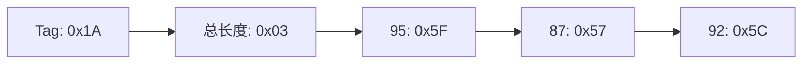
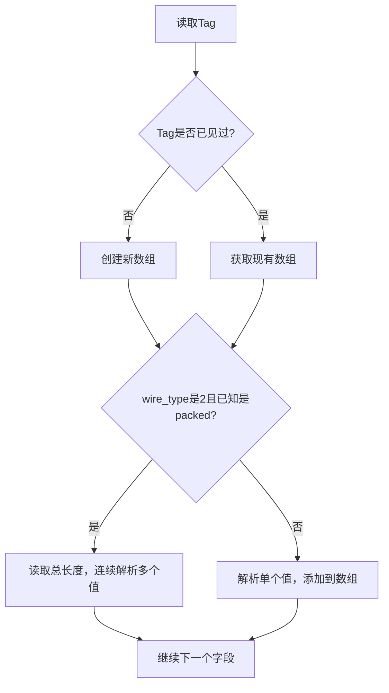

# protobuf怎样组织数组类型数据

在实际的网络通信中，我们经常需要传输列表或数组形式的数据，比如用户的多个标签、商品的多张图片链接、或者一组坐标点。protobuf为这类重复字段提供了非常灵活和高效的编码方式。理解这些编码方式，能够帮助我们在调试时快速识别数组数据的边界和内容。

## repeated字段的基本概念

在protobuf中，我们使用`repeated`关键字来定义数组类型的字段：

```protobuf
message UserProfile {
  int32 user_id = 1;
  repeated string tags = 2;
  repeated int32 scores = 3;
}
```

对于repeated字段，protobuf提供了两种编码方式：
- **unpacked编码**：每个元素单独编码，适用于复杂类型
- **packed编码**：多个元素紧密打包，适用于数值类型

## unpacked编码方式

在unpacked编码中，数组的每个元素都单独进行TLV编码，使用相同的Tag。

假设我们有一个UserProfile对象：
```
{
  user_id: 123,
  tags: ["学生", "游戏", "技术"],
  scores: [95, 87, 92]
}
```

对于tags字段（string类型数组），protobuf会这样编码：

```
Tag(2,2) + Length + "学生" + Tag(2,2) + Length + "游戏" + Tag(2,2) + Length + "技术"
```

具体的字节序列：
```
字段user_id (123):
  0x08 0x7B

字段tags[0] ("学生"):
  0x12 0x06 0xE5 0xAD 0xA6 0xE7 0x94 0x9F

字段tags[1] ("游戏"):
  0x12 0x06 0xE6 0xB8 0xB8 0xE6 0x88 0x8F

字段tags[2] ("技术"):
  0x12 0x06 0xE6 0x8A 0x80 0xE6 0x9C 0xAF
```

解码器通过识别重复的Tag来确定这些是同一个数组的不同元素。

## packed编码方式

对于数值类型的repeated字段，protobuf默认使用packed编码（protobuf 3中）。这种方式将所有元素的值连续存储，只使用一个Tag和一个总长度。

对于scores字段`[95, 87, 92]`的packed编码：



详细分析：
1. Tag计算：(3 << 3) | 2 = 26 = 0x1A（字段3，wire_type 2）
2. 总长度：3个字节（95、87、92各占1字节）
3. 连续的值：0x5F 0x57 0x5C

最终编码为：`0x1A 0x03 0x5F 0x57 0x5C`

## packed vs unpacked对比

让我们比较同样的数据使用两种编码方式的差异：

**unpacked编码scores [95, 87, 92]**：
```
0x18 0x5F 0x18 0x57 0x18 0x5C
```
总共6字节

**packed编码scores [95, 87, 92]**：
```
0x1A 0x03 0x5F 0x57 0x5C
```
总共5字节

可以看出，packed编码在处理数值数组时更加紧凑，特别是当数组元素较多时，节省的空间更明显。

## 不同数据类型的编码策略

根据数据类型的特点，protobuf采用不同的编码策略：

### 基本数值类型（优先packed）

```protobuf
repeated int32 numbers = 1;     // 默认packed
repeated bool flags = 2;        // 默认packed
repeated double values = 3;     // 默认packed
```

这些类型因为单个元素大小固定且较小，packed编码能显著减少开销。

### 字符串和字节类型（只能unpacked）

```protobuf
repeated string names = 4;      // 只能unpacked
repeated bytes data = 5;        // 只能unpacked
```

由于字符串长度不固定，需要为每个元素单独存储长度信息。

### 嵌套消息类型（只能unpacked）

```protobuf
repeated UserInfo users = 6;    // 只能unpacked
```

复杂对象必须单独编码，每个对象都有自己的结构。

## 解码过程中的数组识别

当解码器遇到repeated字段时，处理过程如下：



## 实际调试中的应用

在网络抓包分析中，识别数组数据的技巧：

### 1. 识别unpacked数组
- 寻找重复的Tag
- 每个Tag后跟随独立的Length-Value

### 2. 识别packed数组
- Tag使用wire_type 2（Length-delimited）
- 但字段类型是数值类型
- Length后面跟随连续的数值数据

### 3. 计算数组长度
```python
# unpacked数组：统计Tag出现次数
array_length = count_tag_occurrences(tag_value)

# packed数组：根据总长度和单元素大小计算
array_length = total_length / element_size
```

## 向后兼容性考虑

protobuf的repeated字段具有良好的向后兼容性：

- **packed → unpacked**：新版本可以读取旧版本的unpacked数据
- **unpacked → packed**：旧版本可以读取新版本的packed数据
- **添加元素**：不影响旧版本的解析
- **减少元素**：旧版本会忽略不存在的元素

## 性能优化建议

基于数组编码特性的优化建议：

1. **数值数组优先使用packed**：减少Tag重复开销
2. **合理选择字段编号**：低编号的Tag占用更少字节
3. **避免大数组的频繁修改**：考虑分页或分块处理
4. **字符串数组考虑长度分布**：短字符串多时unpacked优势明显

理解protobuf数组数据的编码方式，不仅能帮助我们更好地调试网络问题，还能指导我们设计更高效的数据结构。下一节我们将探讨更复杂的场景：数组中包含嵌套结构体的情况。

---

*本文档为《网络101》系列的一部分*
