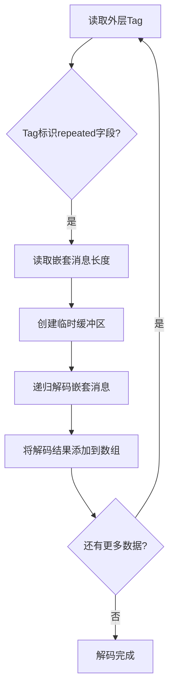

# protobuf怎样组织数组内嵌结构体

在复杂的业务场景中，我们经常遇到需要传输包含嵌套结构体的数组数据，比如用户的多个地址信息、商品的多个规格参数、或者订单的多个商品项。这种数据结构在protobuf中如何编码和解码？理解这个过程，对于分析复杂的网络数据包至关重要。

## 嵌套消息的基本结构

首先，让我们定义一个包含嵌套结构体数组的protobuf消息：

```protobuf
message Address {
  string country = 1;
  string city = 2;
  string street = 3;
}

message User {
  int32 user_id = 1;
  string name = 2;
  repeated Address addresses = 3;
}
```

这里，User消息包含一个Address类型的数组。每个Address本身也是一个复杂的结构体。

## 嵌套消息的编码原理

嵌套消息使用Length-delimited编码（wire_type = 2），这意味着每个嵌套消息都需要：
1. Tag（标识字段编号和类型）
2. Length（消息的总字节长度）
3. Value（完整的嵌套消息内容）

让我们通过一个具体的例子来理解编码过程。假设有这样的用户数据：

```json
{
  "user_id": 1001,
  "name": "张三",
  "addresses": [
    {
      "country": "中国",
      "city": "北京",
      "street": "长安街1号"
    },
    {
      "country": "中国",
      "city": "上海",
      "street": "南京路100号"
    }
  ]
}
```

## 单个嵌套消息的编码

首先，我们来看第一个Address对象的编码：

```
Address {
  country: "中国",
  city: "北京",
  street: "长安街1号"
}
```

### 各字段编码：

**country字段**（字段1，string类型）：
- Tag: (1 << 3) | 2 = 0x0A
- Length: 6字节（"中国"的UTF-8编码）
- Value: 0xE4 0xB8 0xAD 0xE5 0x9B 0xBD

**city字段**（字段2，string类型）：
- Tag: (2 << 3) | 2 = 0x12
- Length: 6字节（"北京"的UTF-8编码）
- Value: 0xE5 0x8C 0x97 0xE4 0xBA 0xAC

**street字段**（字段3，string类型）：
- Tag: (3 << 3) | 2 = 0x1A
- Length: 12字节（"长安街1号"的UTF-8编码）
- Value: 0xE9 0x95 0xBF 0xE5 0xAE 0x89 0xE8 0xA1 0x97 0x31 0xE5 0x8F 0xB7

### 完整的Address编码：

```
0x0A 0x06 0xE4 0xB8 0xAD 0xE5 0x9B 0xBD  // country: "中国"
0x12 0x06 0xE5 0x8C 0x97 0xE4 0xBA 0xAC  // city: "北京"
0x1A 0x0C 0xE9 0x95 0xBF 0xE5 0xAE 0x89 0xE8 0xA1 0x97 0x31 0xE5 0x8F 0xB7  // street: "长安街1号"
```

总长度：32字节

## 嵌套消息数组的编码

现在，我们需要将这个Address作为User.addresses数组的一个元素进行编码：

**addresses字段**（字段3，repeated Address类型）：
- Tag: (3 << 3) | 2 = 0x1A
- Length: 32字节（第一个Address的总长度）
- Value: 上面计算的32字节Address数据

```mermaid
graph TD
    A[User消息开始] --> B[user_id: 0x08 0xE9 0x07]
    B --> C[name: 0x12 0x06 + "张三"的UTF-8]
    C --> D[addresses[0]: 0x1A 0x20 + Address1数据]
    D --> E[addresses[1]: 0x1A 0x1E + Address2数据]
    E --> F[User消息结束]
```

## 完整的User消息编码

让我们组装完整的User消息：

```
用户ID (1001):
0x08 0xE9 0x07

用户名 ("张三"):
0x12 0x06 0xE5 0xBC 0xA0 0xE4 0xB8 0x89

第一个地址:
0x1A 0x20  // Tag和长度(32字节)
[Address1的32字节数据]

第二个地址:
0x1A 0x1E  // Tag和长度(30字节)
[Address2的30字节数据]
```

## 解码过程的挑战

解码嵌套消息数组时，解码器需要处理多层结构：



## 内存布局的考虑

在实际的网络传输中，嵌套消息数组的内存布局如下：

```
[User消息]
├── [基本字段]
├── [Address 1]
│   ├── Tag + Length
│   └── [Address内容]
├── [Address 2]
│   ├── Tag + Length
│   └── [Address内容]
└── [后续字段...]
```

每个嵌套消息都是自包含的，这种设计带来几个优势：
1. **独立性**：每个嵌套消息可以独立解码
2. **跳跃性**：可以跳过不需要的嵌套消息
3. **流式处理**：可以边读边解码

## 性能优化策略

### 1. 字段顺序优化

将频繁访问的字段放在前面，减少不必要的解码开销：

```protobuf
message Address {
  string city = 1;      // 最常用
  string country = 2;   // 次常用
  string street = 3;    // 详细信息
}
```

### 2. 嵌套深度控制

避免过深的嵌套结构，考虑将深层嵌套展平：

```protobuf
// 不推荐：过深嵌套
message User {
  repeated Order orders = 1;
}
message Order {
  repeated OrderItem items = 1;
}
message OrderItem {
  repeated ItemDetail details = 1;
}

// 推荐：适度嵌套
message User {
  repeated Order orders = 1;
}
message Order {
  repeated int32 item_ids = 1;
  map<int32, ItemDetail> item_details = 2;
}
```

## 调试技巧

在分析包含嵌套结构体数组的protobuf数据时：

### 1. 识别嵌套边界
- 每个嵌套消息前都有Length字段
- Length值指示了嵌套消息的确切范围

### 2. 递归解析策略
```python
def parse_nested_array(data, offset):
    results = []
    while offset < len(data):
        tag = read_varint(data, offset)
        if is_nested_message(tag):
            length = read_varint(data, offset)
            nested_data = data[offset:offset+length]
            results.append(parse_message(nested_data))
            offset += length
    return results
```

### 3. 验证数据完整性
- 检查Length值是否与实际数据长度匹配
- 验证嵌套消息的字段是否完整

## 错误处理

常见的错误模式及处理：

1. **长度不匹配**：Length字段值超过实际数据
2. **截断数据**：嵌套消息在传输中被截断
3. **字段缺失**：必需字段在嵌套消息中缺失

理解嵌套结构体数组的编码机制，能够帮助我们在复杂的网络调试场景中快速定位问题。这种深度的理解，也为我们设计高效的数据结构提供了重要的参考依据。

---

*本文档为《网络101》系列的一部分*
