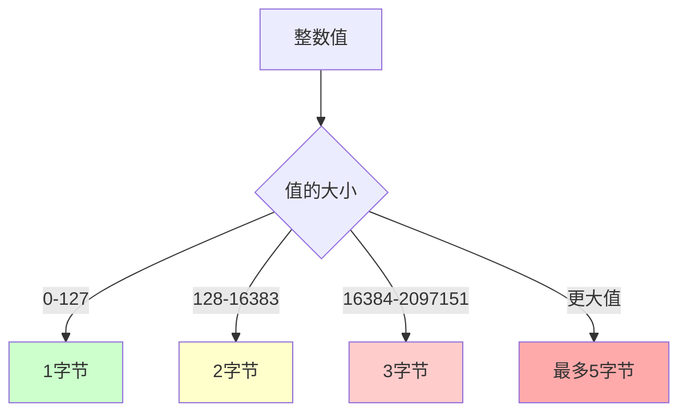
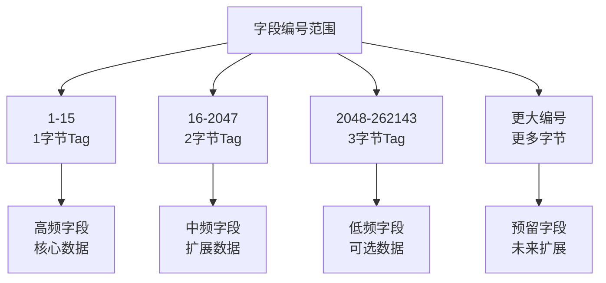
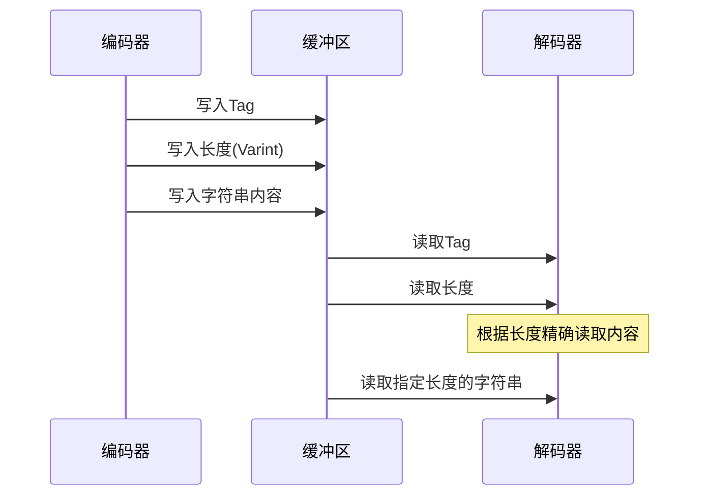

# protobuf做了哪些优化

Protocol Buffers之所以能够在众多序列化格式中脱颖而出，成为高性能系统的首选，很大程度上得益于其精心设计的各种优化策略。这些优化不仅体现在数据编码层面，更贯穿于整个协议的设计理念中。理解这些优化技巧，不仅能帮助我们更好地使用protobuf，也能为我们设计其他高性能系统提供宝贵的参考。

## 编码层面的优化

### 1. Varint变长编码

protobuf最核心的优化之一是使用Varint（Variable-length integers）编码来压缩整数。这种编码方式让小数值占用更少的字节：



**传统固定长度 vs Varint编码对比：**

```python
# 传统32位整数编码示例
def traditional_encoding():
    values = [1, 127, 128, 16383, 16384]
    
    # 固定32位编码：每个数都占4字节
    traditional_size = len(values) * 4  # 20字节
    
    # Varint编码：根据值的大小动态调整
    varint_sizes = [1, 1, 2, 2, 3]  # 对应上述值的字节数
    varint_size = sum(varint_sizes)  # 9字节
    
    print(f"传统编码: {traditional_size}字节")
    print(f"Varint编码: {varint_size}字节")
    print(f"压缩率: {(1 - varint_size/traditional_size)*100:.1f}%")

# 输出：
# 传统编码: 20字节
# Varint编码: 9字节  
# 压缩率: 55.0%
```

### 2. ZigZag编码优化负数

对于有符号整数，protobuf使用ZigZag编码将负数映射为正数，使得小的负数也能享受Varint编码的优势：

```python
def zigzag_encode(n):
    """ZigZag编码：将有符号整数映射为无符号整数"""
    return (n << 1) ^ (n >> 31)

def zigzag_decode(n):
    """ZigZag解码：恢复原始有符号整数"""
    return (n >> 1) ^ (-(n & 1))

# 编码效果演示
test_values = [-1, -2, -3, 1, 2, 3]
print("原值 -> ZigZag编码 -> Varint字节数")
for val in test_values:
    encoded = zigzag_encode(val)
    bytes_needed = 1 if encoded < 128 else 2
    print(f"{val:3d} -> {encoded:3d} -> {bytes_needed}字节")

# 输出：
# -1 ->   1 -> 1字节
# -2 ->   3 -> 1字节  
# -3 ->   5 -> 1字节
#  1 ->   2 -> 1字节
#  2 ->   4 -> 1字节
#  3 ->   6 -> 1字节
```

### 3. 字段编号优化

protobuf的字段编号不仅用于标识字段，还直接影响编码效率。编号1-15只需要1个字节的Tag，而编号16-2047需要2个字节：



**字段编号策略示例：**

```protobuf
message OptimizedUser {
  // 核心字段：使用1-15编号（1字节Tag）
  int32 user_id = 1;        // 最重要，使用最小编号
  string username = 2;      // 高频访问
  string email = 3;         // 登录必需
  bool is_active = 4;       // 状态检查
  int64 created_at = 5;     // 时间戳
  
  // 扩展字段：使用16+编号（2字节Tag）
  string full_name = 16;    // 显示用途
  string avatar_url = 17;   // 头像链接
  repeated string tags = 18; // 标签数组
  
  // 可选字段：使用更大编号
  string bio = 100;         // 个人简介
  map<string, string> metadata = 101; // 元数据
}
```

## 数据结构优化

### 1. Packed数组编码

对于数值类型的重复字段，protobuf使用packed编码来减少Tag重复：

```python
# 演示packed vs unpacked编码差异
def compare_array_encoding():
    # 假设有一个包含1000个整数的数组
    array_size = 1000
    
    # Unpacked编码：每个元素都有Tag
    # Tag(1字节) + Value(平均2字节) = 3字节/元素
    unpacked_size = array_size * 3  # 3000字节
    
    # Packed编码：一个Tag + 长度 + 所有值
    # Tag(1字节) + Length(2字节) + Values(2000字节)
    packed_size = 1 + 2 + (array_size * 2)  # 2003字节
    
    print(f"Unpacked编码: {unpacked_size}字节")
    print(f"Packed编码: {packed_size}字节")
    print(f"节省空间: {unpacked_size - packed_size}字节")
    print(f"压缩率: {(1 - packed_size/unpacked_size)*100:.1f}%")

# 输出：
# Unpacked编码: 3000字节
# Packed编码: 2003字节
# 节省空间: 997字节
# 压缩率: 33.2%
```

### 2. 默认值优化

protobuf不会序列化默认值，这大大减少了数据大小：

```protobuf
message UserPreferences {
  bool email_notifications = 1;    // 默认false，不序列化
  int32 theme_id = 2;              // 默认0，不序列化
  string language = 3;             // 默认""，不序列化
  repeated string interests = 4;    // 默认空数组，不序列化
}
```

```python
# 默认值优化效果演示
def demonstrate_default_value_optimization():
    # 创建两个用户偏好对象
    # 用户1：使用默认值
    user1_prefs = UserPreferences()
    
    # 用户2：设置非默认值
    user2_prefs = UserPreferences()
    user2_prefs.email_notifications = True
    user2_prefs.theme_id = 2
    user2_prefs.language = "zh-CN"
    user2_prefs.interests.extend(["tech", "travel"])
    
    # 序列化大小对比
    user1_size = len(user1_prefs.SerializeToString())  # 0字节！
    user2_size = len(user2_prefs.SerializeToString())  # 约20字节
    
    print(f"默认值用户序列化大小: {user1_size}字节")
    print(f"自定义值用户序列化大小: {user2_size}字节")
```

### 3. 字符串和字节优化

protobuf对字符串和字节数据使用长度前缀编码，避免了分隔符的开销：



## 内存和性能优化

### 1. 延迟解析（Lazy Parsing）

protobuf支持延迟解析，只有在实际访问字段时才进行解码：

```cpp
// C++中的延迟解析示例
class LazyMessage {
private:
    std::string raw_data_;
    mutable std::unique_ptr<ParsedData> parsed_data_;
    
public:
    // 构造时不解析，只存储原始数据
    LazyMessage(const std::string& data) : raw_data_(data) {}
    
    // 访问时才解析
    const std::string& GetUsername() const {
        if (!parsed_data_) {
            parsed_data_ = std::make_unique<ParsedData>();
            parsed_data_->ParseFromString(raw_data_);
        }
        return parsed_data_->username();
    }
};
```

### 2. 对象池和内存重用

```python
class ProtobufObjectPool:
    """protobuf对象池，减少内存分配开销"""
    
    def __init__(self, message_class, pool_size=100):
        self.message_class = message_class
        self.pool = []
        self.pool_size = pool_size
        
        # 预分配对象
        for _ in range(pool_size):
            self.pool.append(message_class())
    
    def get_message(self):
        """获取消息对象"""
        if self.pool:
            msg = self.pool.pop()
            msg.Clear()  # 清空之前的数据
            return msg
        else:
            # 池空时创建新对象
            return self.message_class()
    
    def return_message(self, msg):
        """归还消息对象"""
        if len(self.pool) < self.pool_size:
            self.pool.append(msg)

# 使用示例
user_pool = ProtobufObjectPool(UserProfile, 50)

def process_user_data(raw_data):
    user = user_pool.get_message()
    try:
        user.ParseFromString(raw_data)
        # 处理用户数据
        return process_user(user)
    finally:
        user_pool.return_message(user)
```

### 3. 零拷贝优化

protobuf在某些情况下支持零拷贝操作，直接引用原始数据而不进行复制：

```cpp
// C++零拷贝字符串视图
class ZeroCopyStringView {
private:
    const char* data_;
    size_t length_;
    
public:
    ZeroCopyStringView(const char* data, size_t length) 
        : data_(data), length_(length) {}
    
    // 不复制数据，直接返回视图
    std::string_view GetView() const {
        return std::string_view(data_, length_);
    }
};
```

## 网络传输优化

### 1. 批量序列化

```python
def batch_serialize_users(users):
    """批量序列化用户数据，减少系统调用"""
    buffer = []
    total_size = 0
    
    for user in users:
        serialized = user.SerializeToString()
        # 添加长度前缀，便于解析
        length_prefix = len(serialized).to_bytes(4, 'big')
        buffer.append(length_prefix + serialized)
        total_size += len(serialized) + 4
    
    return b''.join(buffer), total_size

def batch_deserialize_users(data):
    """批量反序列化用户数据"""
    users = []
    offset = 0
    
    while offset < len(data):
        # 读取长度前缀
        length = int.from_bytes(data[offset:offset+4], 'big')
        offset += 4
        
        # 读取消息数据
        message_data = data[offset:offset+length]
        offset += length
        
        # 反序列化
        user = UserProfile()
        user.ParseFromString(message_data)
        users.append(user)
    
    return users
```

### 2. 压缩集成

protobuf可以与各种压缩算法结合使用：

```python
import gzip
import lz4.frame
import zstandard as zstd

def compress_protobuf_data(message, algorithm='gzip'):
    """压缩protobuf数据"""
    serialized = message.SerializeToString()
    
    if algorithm == 'gzip':
        return gzip.compress(serialized)
    elif algorithm == 'lz4':
        return lz4.frame.compress(serialized)
    elif algorithm == 'zstd':
        cctx = zstd.ZstdCompressor()
        return cctx.compress(serialized)
    else:
        return serialized

def decompress_protobuf_data(compressed_data, message_class, algorithm='gzip'):
    """解压并反序列化protobuf数据"""
    if algorithm == 'gzip':
        serialized = gzip.decompress(compressed_data)
    elif algorithm == 'lz4':
        serialized = lz4.frame.decompress(compressed_data)
    elif algorithm == 'zstd':
        dctx = zstd.ZstdDecompressor()
        serialized = dctx.decompress(compressed_data)
    else:
        serialized = compressed_data
    
    message = message_class()
    message.ParseFromString(serialized)
    return message
```

## 向后兼容性优化

### 1. 字段演进策略

protobuf的向后兼容性设计让系统能够平滑升级：

```protobuf
// 版本1：初始设计
message UserV1 {
  int32 user_id = 1;
  string username = 2;
}

// 版本2：添加新字段
message UserV2 {
  int32 user_id = 1;
  string username = 2;
  string email = 3;        // 新增字段
  bool is_verified = 4;    // 新增字段
}

// 版本3：废弃字段但保留编号
message UserV3 {
  int32 user_id = 1;
  string username = 2;
  string email = 3;
  bool is_verified = 4;
  // string old_field = 5;  // 已废弃，保留编号
  string display_name = 6;  // 新字段使用新编号
}
```

### 2. 未知字段处理

```python
def handle_unknown_fields(message):
    """处理未知字段，保持向前兼容"""
    # protobuf会自动保留未知字段
    serialized = message.SerializeToString()
    
    # 即使使用旧版本的消息定义解析
    # 未知字段也会被保留
    old_message = OldVersionMessage()
    old_message.ParseFromString(serialized)
    
    # 重新序列化时，未知字段会被保留
    return old_message.SerializeToString()
```

## 调试和监控优化

### 1. 性能监控

```python
import time
from collections import defaultdict

class ProtobufProfiler:
    """protobuf性能分析器"""
    
    def __init__(self):
        self.stats = defaultdict(list)
    
    def profile_serialization(self, message, message_type):
        """分析序列化性能"""
        start_time = time.perf_counter()
        serialized = message.SerializeToString()
        end_time = time.perf_counter()
        
        self.stats[f"{message_type}_serialize_time"].append(end_time - start_time)
        self.stats[f"{message_type}_serialize_size"].append(len(serialized))
        
        return serialized
    
    def profile_deserialization(self, data, message_class, message_type):
        """分析反序列化性能"""
        start_time = time.perf_counter()
        message = message_class()
        message.ParseFromString(data)
        end_time = time.perf_counter()
        
        self.stats[f"{message_type}_deserialize_time"].append(end_time - start_time)
        
        return message
    
    def get_stats(self):
        """获取统计信息"""
        result = {}
        for key, values in self.stats.items():
            result[key] = {
                'count': len(values),
                'avg': sum(values) / len(values),
                'min': min(values),
                'max': max(values)
            }
        return result
```

### 2. 内存使用监控

```python
import psutil
import os

def monitor_protobuf_memory():
    """监控protobuf内存使用"""
    process = psutil.Process(os.getpid())
    
    # 获取内存使用情况
    memory_info = process.memory_info()
    
    return {
        'rss': memory_info.rss,  # 物理内存
        'vms': memory_info.vms,  # 虚拟内存
        'percent': process.memory_percent()  # 内存使用百分比
    }
```

## 总结

protobuf的优化策略体现了系统设计中的多个重要原则：

### 编码优化
- **Varint编码**：小数值占用更少字节
- **ZigZag编码**：优化负数表示
- **Packed数组**：减少重复Tag开销
- **默认值跳过**：不序列化默认值

### 性能优化
- **延迟解析**：按需解码字段
- **对象池**：减少内存分配
- **零拷贝**：避免不必要的数据复制
- **批量处理**：减少系统调用

### 兼容性优化
- **字段编号保留**：确保向后兼容
- **未知字段保留**：支持向前兼容
- **渐进式升级**：平滑的版本演进

这些优化策略的综合运用，使得protobuf在保持高性能的同时，还具备了良好的可维护性和扩展性。理解这些优化原理，不仅能帮助我们更好地使用protobuf，也为我们设计其他高性能系统提供了宝贵的参考。

---

*本文档为《网络101》系列的一部分*
