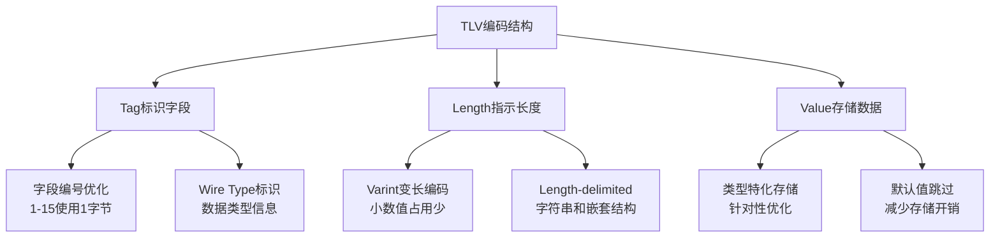
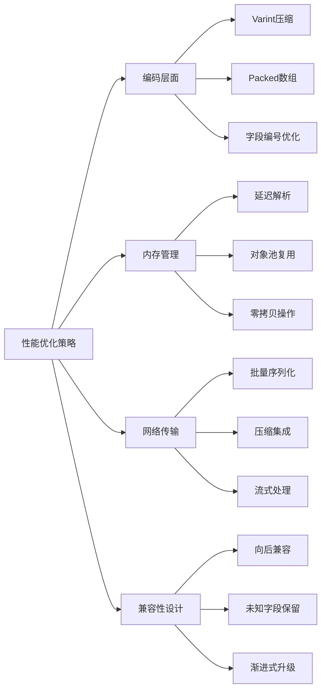
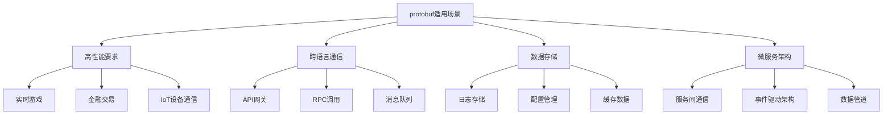

# 小结

通过本章的学习，我们深入探索了protobuf数据的内部世界，从基础的编码原理到复杂的优化策略，从数据组织方式到实用的分析工具。protobuf之所以能够成为现代高性能系统的首选序列化协议，正是因为其精妙的设计理念和全方位的优化策略。

## 核心技术要点回顾

### 1. 编码机制的精髓

protobuf的核心是Tag-Length-Value（TLV）编码结构，这种设计带来了多重优势：



**关键优化策略：**
- **Varint编码**：让小整数只占用1个字节，大幅减少常见数据的存储空间
- **ZigZag编码**：将有符号整数映射为无符号整数，优化负数的表示
- **字段编号策略**：高频字段使用1-15编号，减少Tag开销
- **默认值优化**：不序列化默认值，显著减少数据量

### 2. 数据结构组织的智慧

protobuf针对不同的数据结构采用了相应的优化策略：

**基础数据类型：**
```python
# 编码效率对比示例
def encoding_efficiency_demo():
    # 小整数：1字节Tag + 1字节值 = 2字节
    small_int = 42
    
    # 大整数：1字节Tag + 5字节值 = 6字节（最多）
    large_int = 2**28
    
    # 字符串：1字节Tag + 长度(Varint) + 内容
    text = "Hello"  # 1 + 1 + 5 = 7字节
    
    return {
        'small_int_bytes': 2,
        'large_int_bytes': 6,
        'string_bytes': 7
    }
```

**数组和重复字段：**
- **Packed编码**：数值类型数组使用连续存储，减少Tag重复
- **Unpacked编码**：复杂类型保持独立Tag，便于流式处理
- **嵌套结构**：递归应用TLV编码，保持结构清晰

### 3. 性能优化的全方位考量

protobuf的性能优化体现在多个层面：



## 实践应用指南

### 1. 设计最佳实践

基于我们学到的原理，在实际项目中应该：

```protobuf
message OptimizedMessage {
  // 1. 核心字段使用1-15编号
  int32 id = 1;
  string name = 2;
  bool active = 3;
  
  // 2. 数值数组使用packed编码
  repeated int32 scores = 4 [packed=true];
  
  // 3. 为未来扩展预留编号空间
  // 16-100: 常用扩展字段
  string description = 16;
  
  // 101-1000: 特殊功能字段
  map<string, string> metadata = 101;
  
  // 1001+: 实验性字段
  optional ExperimentalFeature feature = 1001;
}
```

### 2. 调试和分析策略

当遇到protobuf相关问题时，我们现在具备了系统性的分析能力：

```python
def debug_protobuf_issue(binary_data):
    """系统性的protobuf调试方法"""
    
    # 1. 基础格式验证
    try:
        # 尝试解析为通用消息
        from google.protobuf.message import Message
        # 检查基本的TLV结构
        validate_tlv_structure(binary_data)
    except Exception as e:
        print(f"基础格式错误: {e}")
        return
    
    # 2. 字段级别分析
    field_analysis = analyze_fields(binary_data)
    print("字段分析结果:")
    for field_num, field_info in field_analysis.items():
        print(f"  字段{field_num}: {field_info}")
    
    # 3. 性能分析
    perf_metrics = analyze_performance(binary_data)
    print(f"数据大小: {len(binary_data)}字节")
    print(f"压缩率: {perf_metrics['compression_ratio']:.2%}")
    
    # 4. 兼容性检查
    compatibility_issues = check_compatibility(binary_data)
    if compatibility_issues:
        print("兼容性问题:", compatibility_issues)
```

### 3. 性能监控和优化

建立完整的protobuf性能监控体系：

```python
class ProtobufMonitor:
    """protobuf性能监控器"""
    
    def __init__(self):
        self.metrics = {
            'serialization_time': [],
            'deserialization_time': [],
            'message_sizes': [],
            'field_usage': defaultdict(int)
        }
    
    def monitor_operation(self, operation_type, message, duration, size):
        """监控protobuf操作"""
        self.metrics[f'{operation_type}_time'].append(duration)
        if size:
            self.metrics['message_sizes'].append(size)
        
        # 分析字段使用情况
        for field in message.ListFields():
            field_name = field[0].name
            self.metrics['field_usage'][field_name] += 1
    
    def generate_optimization_report(self):
        """生成优化建议报告"""
        report = []
        
        # 性能分析
        avg_ser_time = np.mean(self.metrics['serialization_time'])
        avg_deser_time = np.mean(self.metrics['deserialization_time'])
        avg_size = np.mean(self.metrics['message_sizes'])
        
        report.append(f"平均序列化时间: {avg_ser_time:.4f}ms")
        report.append(f"平均反序列化时间: {avg_deser_time:.4f}ms")
        report.append(f"平均消息大小: {avg_size:.1f}字节")
        
        # 字段使用分析
        sorted_fields = sorted(
            self.metrics['field_usage'].items(), 
            key=lambda x: x[1], 
            reverse=True
        )
        
        report.append("\n字段使用频率排序:")
        for field_name, count in sorted_fields[:10]:
            report.append(f"  {field_name}: {count}次")
        
        return "\n".join(report)
```

## 技术演进和未来展望

### 1. protobuf的技术优势

通过深入学习，我们可以总结protobuf的核心优势：

- **高效性**：精心设计的编码策略，实现了空间和时间的双重优化
- **兼容性**：向前向后兼容的设计，支持系统的平滑演进
- **跨语言**：统一的数据格式，支持多语言生态系统
- **可扩展性**：灵活的字段管理，适应业务需求的变化

### 2. 适用场景分析



### 3. 与其他格式的对比

| 特性 | protobuf | JSON | XML | MessagePack |
|------|----------|------|-----|-------------|
| 数据大小 | 很小 | 大 | 很大 | 小 |
| 解析速度 | 很快 | 中等 | 慢 | 快 |
| 可读性 | 需工具 | 高 | 高 | 需工具 |
| 类型安全 | 强 | 弱 | 弱 | 中等 |
| 向后兼容 | 优秀 | 一般 | 一般 | 一般 |
| 跨语言支持 | 优秀 | 优秀 | 优秀 | 良好 |

## 学习成果总结

通过本章的系统学习，我们已经掌握了：

### 理论基础
- protobuf的编码原理和数据组织方式
- TLV结构、Varint编码、字段编号策略等核心概念
- 各种优化技术的原理和应用场景

### 实践技能
- 能够分析和解读protobuf二进制数据
- 掌握了调试protobuf问题的系统方法
- 具备了设计高效protobuf消息的能力

### 工程应用
- 了解了protobuf在实际项目中的最佳实践
- 学会了性能监控和优化的方法
- 能够根据业务需求选择合适的序列化策略

## 持续学习建议

protobuf作为一个不断演进的技术，建议继续关注：

1. **新版本特性**：关注protobuf新版本的功能更新和性能改进
2. **生态系统发展**：了解相关工具和库的发展情况
3. **实际项目应用**：在实际项目中应用所学知识，积累经验
4. **性能调优**：深入研究特定场景下的性能优化技巧

掌握protobuf不仅仅是学会一种数据格式，更重要的是理解高效数据交换协议的设计思想。这种思想可以应用到更广泛的系统设计中，帮助我们构建更高效、更可靠的分布式系统。

当我们面对复杂的网络通信问题时，protobuf的知识将成为我们分析和解决问题的有力工具。无论是在微服务架构中优化服务间通信，还是在大数据系统中提高数据处理效率，protobuf的原理和技巧都将发挥重要作用。

---

*本文档为《网络101》系列的一部分*
