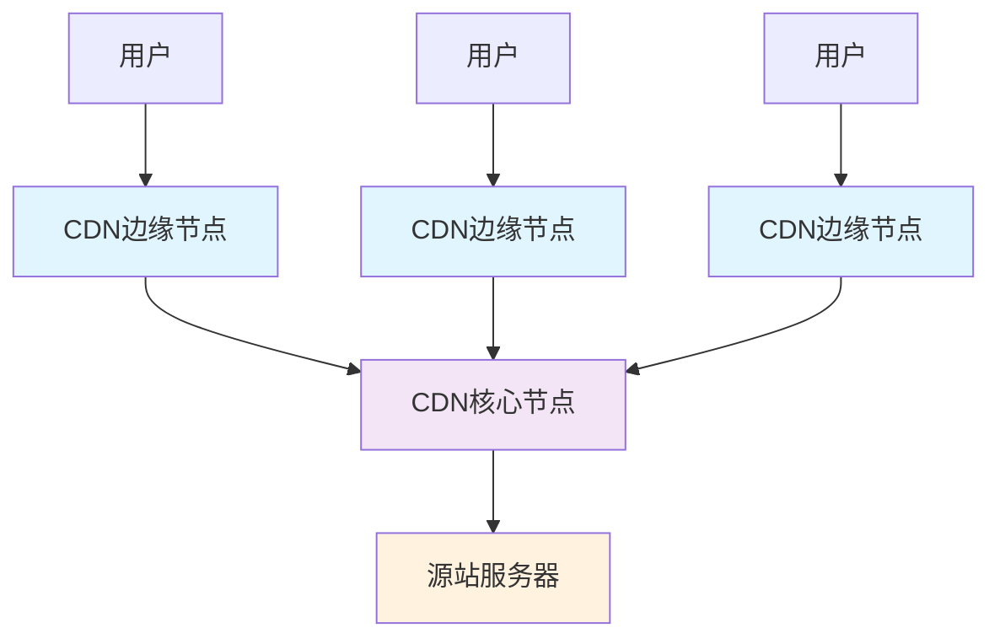
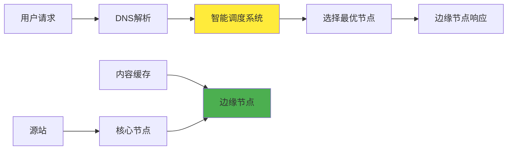

# 5.8.1 CDN是什么

内容分发网络（Content Delivery Network，CDN）是一种分布式的网络架构，通过在全球各地部署缓存服务器，将内容缓存到离用户最近的节点，从而提高内容访问速度和用户体验。CDN的核心思想是"就近服务"，让用户能够从距离最近、网络条件最好的服务器获取所需的内容。

## CDN的基本概念

CDN本质上是一个由分布在不同地理位置的服务器组成的网络系统。这些服务器被称为边缘节点（Edge Node）或缓存节点（Cache Node），它们存储着原始服务器（Origin Server）上内容的副本。当用户请求某个资源时，CDN系统会自动将请求路由到最适合的边缘节点，而不是直接访问原始服务器。

这种架构的优势在于减少了数据传输的物理距离，降低了网络延迟，同时也分散了原始服务器的负载压力。对于用户来说，他们通常感受不到这个过程，只是发现访问速度变快了。

## CDN的发展历程

CDN技术的发展可以追溯到1990年代末期，当时互联网开始快速普及，网络拥塞问题日益严重。最初的CDN主要用于缓存静态内容，如图片、CSS文件和JavaScript文件。随着技术的发展，现代CDN已经能够处理动态内容、视频流、API请求等各种类型的网络流量。

早期的CDN服务主要由Akamai等公司提供，主要服务于大型企业和媒体公司。随着云计算的兴起，Amazon CloudFront、Google Cloud CDN、Microsoft Azure CDN等云服务商也推出了自己的CDN服务，使得中小企业也能够轻松使用CDN技术。

近年来，随着边缘计算概念的兴起，CDN正在向更加智能化的方向发展。现代CDN不仅仅是简单的内容缓存，还集成了安全防护、性能优化、实时分析等功能，成为了一个综合性的边缘服务平台。

## CDN的核心组件

一个完整的CDN系统通常包含以下几个核心组件：

**边缘节点（Edge Nodes）**是CDN系统的前沿，直接面向用户提供服务。这些节点通常部署在网络接入点（POP，Point of Presence）或互联网交换点（IXP，Internet Exchange Point）附近，以确保与用户的网络距离最短。边缘节点的主要功能是缓存热门内容，处理用户请求，并在必要时向上级节点或源站请求内容。

**核心节点（Core Nodes）**位于CDN网络的中心层，负责协调各个边缘节点之间的内容分发和负载均衡。核心节点通常具有更大的存储容量和更强的处理能力，能够存储更多的内容副本，并处理边缘节点无法满足的请求。

**源站（Origin Server）**是内容的原始存储位置，通常是客户的Web服务器或应用服务器。当CDN节点没有缓存所需内容时，会向源站发起回源请求，获取最新的内容并缓存到本地。

**智能调度系统**是CDN的大脑，负责根据用户的地理位置、网络状况、节点负载等因素，智能地选择最优的服务节点。这个系统通常基于DNS解析或HTTP重定向来实现用户请求的路由。

## CDN的服务类型

根据服务内容的不同，CDN可以分为几种主要类型：

**静态内容CDN**主要用于加速静态资源的分发，如图片、CSS文件、JavaScript文件、字体文件等。这类内容的特点是更新频率低，缓存时间长，非常适合通过CDN进行分发。静态内容CDN是最传统也是最成熟的CDN应用场景。

**动态内容CDN**用于加速动态生成的内容，如API响应、个性化页面、实时数据等。虽然动态内容无法像静态内容那样长时间缓存，但CDN仍然可以通过智能路由、连接优化、协议优化等方式来提升访问速度。

**视频CDN**专门用于视频内容的分发，这是目前CDN市场增长最快的领域。视频CDN不仅要处理大文件的传输，还要支持自适应码率、实时转码、直播流分发等复杂功能。

**安全CDN**将安全防护功能集成到CDN服务中，提供DDoS防护、Web应用防火墙（WAF）、SSL/TLS加密等安全服务。这类CDN不仅能提升性能，还能增强网站的安全性。

## CDN的技术特点

CDN技术具有几个显著的特点，这些特点决定了它在现代互联网架构中的重要地位：

**地理分布性**是CDN最基本的特点。通过在全球各地部署服务器节点，CDN能够让用户就近获取内容，显著减少网络延迟。这种分布式架构也提高了系统的可靠性，即使某些节点出现故障，其他节点仍然可以继续提供服务。

**智能化调度**使CDN能够根据实时的网络状况和节点负载情况，动态地选择最优的服务路径。这种智能化不仅体现在节点选择上，还体现在内容预取、缓存策略、负载均衡等各个方面。

**缓存优化**是CDN提升性能的核心机制。通过智能的缓存策略，CDN能够预测用户的访问模式，提前将热门内容缓存到边缘节点。同时，CDN还会根据内容的特性和访问频率，动态调整缓存时间和缓存策略。

**协议优化**让CDN能够在传输层面进行优化，如使用HTTP/2、QUIC等新协议，启用Gzip压缩，优化TCP连接等。这些优化措施能够进一步提升内容传输的效率。

## CDN与传统架构的对比

在没有CDN的传统架构中，所有用户的请求都直接指向源站服务器。这种架构存在几个明显的问题：首先是地理距离导致的延迟问题，远距离用户访问服务器需要经过多个网络节点，延迟较高；其次是服务器负载集中的问题，所有请求都集中在源站，容易造成性能瓶颈；最后是单点故障的风险，一旦源站出现问题，整个服务就会不可用。

CDN架构通过分布式的设计解决了这些问题。用户请求被分散到各个边缘节点，减轻了源站的负载压力；地理上的就近服务显著降低了访问延迟；多节点的冗余设计提高了系统的可靠性。这种架构转变不仅提升了用户体验，也为服务提供商带来了更好的可扩展性和成本效益。

通过理解CDN的基本概念和技术特点，我们可以看到CDN不仅仅是一个简单的缓存系统，而是一个复杂的分布式网络服务平台。它的价值不仅在于提升访问速度，更在于为现代互联网应用提供了一个可靠、可扩展的基础设施支撑。

---

*本文档为《网络101》系列的一部分*
