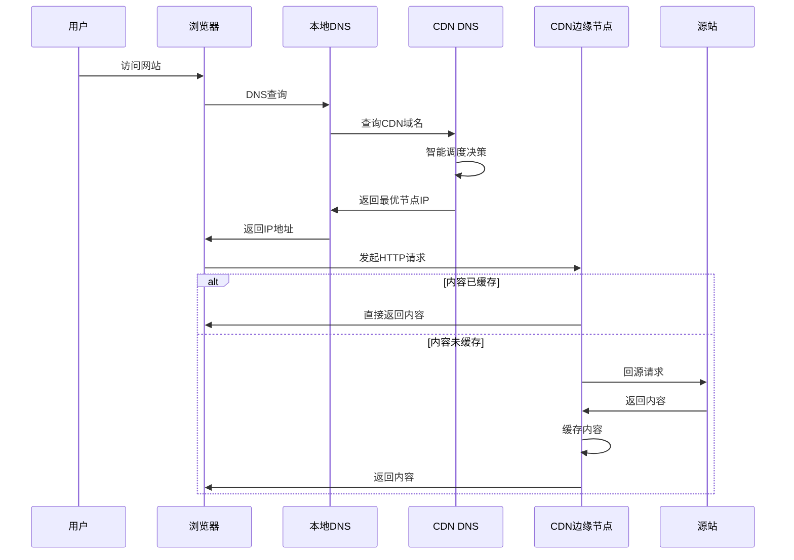
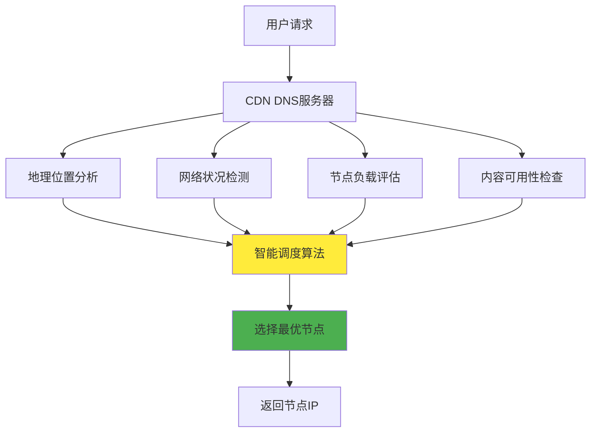
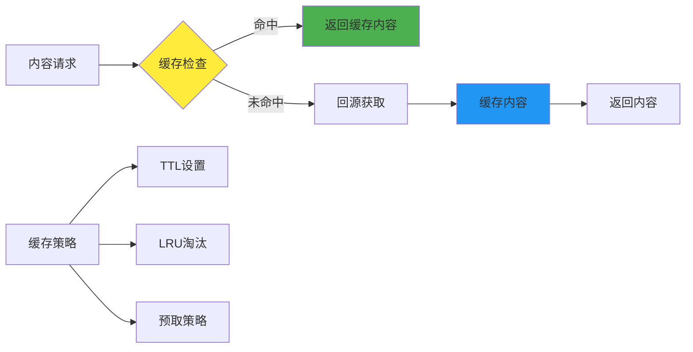
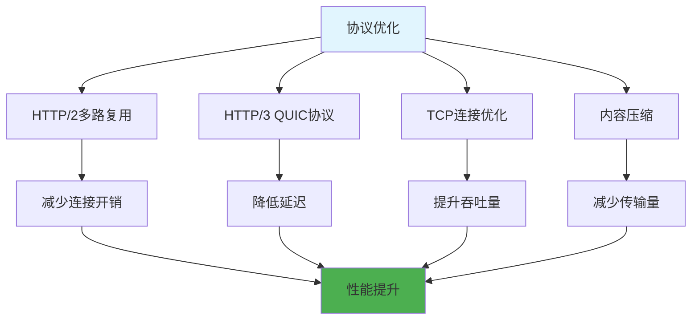

# 5.8.2 CDN的工作原理

CDN的工作原理看似简单，但实际上涉及多个复杂的技术环节。从用户发起请求到最终获得内容，整个过程包括DNS解析、智能路由、内容缓存、负载均衡等多个步骤。理解这些步骤的工作机制，对于优化CDN性能和解决相关问题至关重要。

## 完整的请求流程

当用户在浏览器中输入一个URL或点击一个链接时，CDN系统就开始发挥作用。整个过程可以分为几个关键阶段，每个阶段都有其特定的技术实现和优化策略。

用户首先发起DNS查询，这是整个CDN工作流程的起点。浏览器需要将域名解析为IP地址才能建立网络连接。对于使用CDN的网站，这个DNS解析过程与普通网站有所不同，它会涉及到CNAME记录和CDN服务商的智能DNS系统。

## DNS解析与智能调度

CDN的智能调度系统是整个架构的核心，它决定了用户请求被路由到哪个边缘节点。这个决策过程需要考虑多个因素，包括用户的地理位置、网络状况、节点负载、内容可用性等。

当CDN的DNS服务器收到解析请求时，它不会简单地返回一个固定的IP地址，而是会根据请求来源的IP地址、当前网络状况和节点负载情况，动态地选择最优的边缘节点。这个过程通常在毫秒级别完成，用户几乎感受不到延迟。

智能调度算法通常采用多种策略的组合。地理位置是最基本的考虑因素，系统会优先选择距离用户最近的节点。但仅仅考虑地理距离是不够的，网络拓扑结构、运营商网络、节点负载状况等因素同样重要。

## 内容缓存机制

CDN的缓存机制是提升性能的关键所在。不同类型的内容需要采用不同的缓存策略，这些策略需要在性能、一致性和存储成本之间找到平衡。

静态内容如图片、CSS、JavaScript文件通常具有较长的缓存时间，因为这些文件的更新频率相对较低。CDN会根据HTTP头中的Cache-Control和Expires字段来确定缓存时间，同时也会考虑文件的访问频率和重要性。

动态内容的缓存策略更加复杂。虽然动态内容无法长时间缓存，但CDN仍然可以通过短时间缓存、边缘计算、内容预取等方式来提升性能。例如，API响应可能只缓存几秒钟或几分钟，但这已经足够显著减少源站的负载。

缓存的更新和失效机制同样重要。当源站的内容发生变化时，CDN需要及时更新或清除相关的缓存。这可以通过主动推送、定时刷新、版本控制等方式来实现。

## 负载均衡与故障转移

CDN系统需要处理大量的并发请求，因此负载均衡是确保系统稳定运行的重要机制。CDN的负载均衡不仅发生在DNS层面，也发生在每个边缘节点内部。

在DNS层面，智能调度系统会根据各个节点的负载情况来分配用户请求。当某个节点负载过高时，新的请求会被路由到其他可用的节点。这种负载均衡是动态的，会根据实时的监控数据进行调整。

在节点内部，CDN也会采用多种负载均衡策略。例如，一个边缘节点可能包含多台服务器，请求会根据服务器的负载情况进行分配。常用的负载均衡算法包括轮询、加权轮询、最少连接数、响应时间等。

故障转移机制确保了CDN系统的高可用性。当某个节点出现故障时，DNS系统会自动将流量切换到其他健康的节点。这个过程通常是自动的，用户不会感受到服务中断。

## 协议优化与传输加速

现代CDN不仅仅是简单的内容缓存，还会在协议层面进行各种优化来提升传输性能。这些优化措施包括HTTP协议优化、TCP连接优化、压缩算法应用等。

HTTP/2和HTTP/3等新协议的应用显著提升了传输效率。HTTP/2支持多路复用，可以在单个连接上并行传输多个资源，减少了连接建立的开销。HTTP/3基于QUIC协议，进一步减少了连接建立时间和头部阻塞问题。

TCP连接优化包括连接复用、长连接保持、拥塞控制算法优化等。CDN会维护与用户和源站之间的长连接，避免频繁的连接建立和断开。同时，CDN也会根据网络状况调整TCP参数，优化传输性能。

内容压缩是另一个重要的优化手段。CDN会根据内容类型和用户的支持情况，选择合适的压缩算法。Gzip、Brotli等压缩算法可以显著减少传输的数据量，特别是对于文本类内容效果明显。

## 边缘计算与动态内容处理

随着边缘计算技术的发展，现代CDN已经不仅仅是被动的内容缓存系统，而是具备了一定的计算能力。边缘节点可以执行简单的业务逻辑，处理动态请求，甚至进行实时的内容生成和个性化处理。

边缘计算的应用场景包括图片处理、视频转码、API网关、A/B测试、个性化推荐等。通过在边缘节点执行这些计算任务，可以减少与源站的交互，提升响应速度，同时也减轻了源站的计算负载。

动态内容的处理策略也在不断演进。除了传统的缓存策略外，CDN还会采用内容预取、智能预测、实时生成等技术来优化动态内容的分发。例如，根据用户的访问模式预测可能需要的内容，提前缓存到边缘节点。

## 监控与性能优化

CDN系统需要实时监控各个节点的运行状况，包括响应时间、命中率、错误率、带宽使用情况等关键指标。这些监控数据不仅用于故障检测和性能优化，也为智能调度提供决策依据。

性能优化是一个持续的过程，需要根据监控数据和用户反馈不断调整策略。优化的方向包括缓存策略调整、节点部署优化、路由算法改进、协议参数调优等。

通过深入理解CDN的工作原理，我们可以更好地利用CDN技术来优化应用性能。同时，这种理解也有助于我们在遇到问题时能够快速定位和解决，确保CDN系统能够发挥最大的效用。

---

*本文档为《网络101》系列的一部分*
