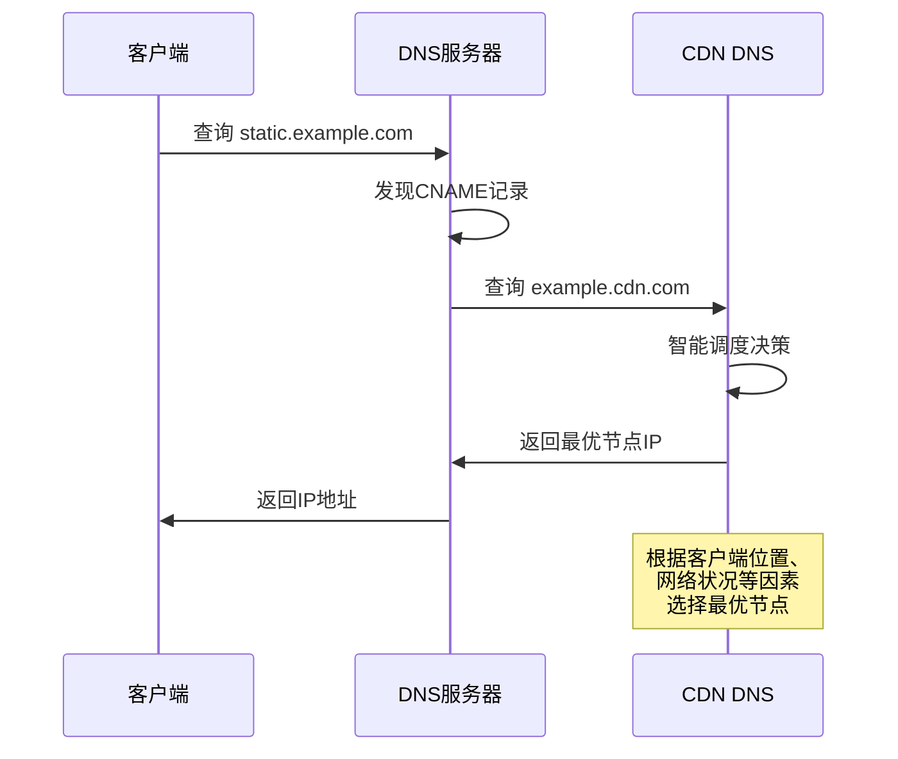
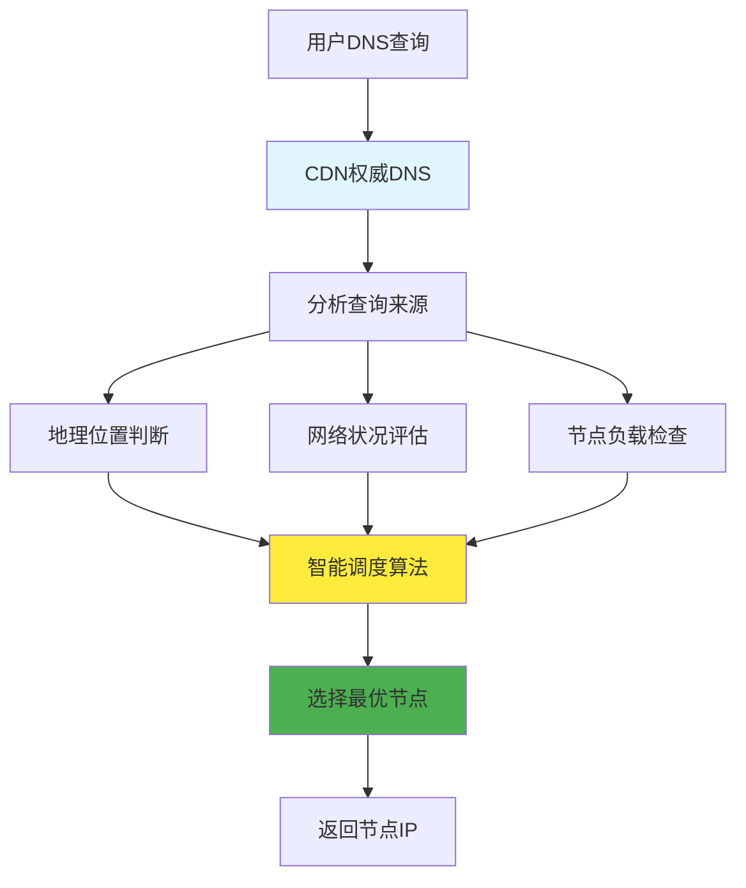
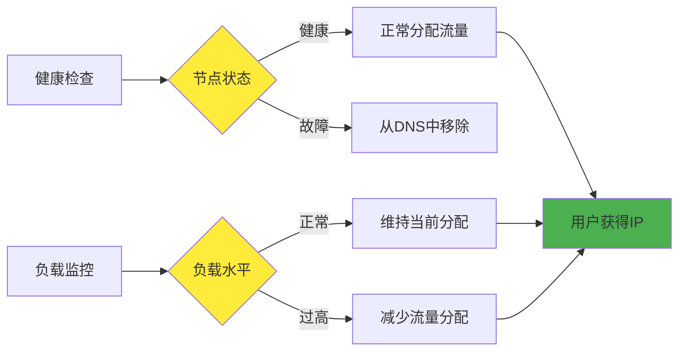

# 5.8.3 为什么要那么麻烦加一个CNAME

在配置CDN时，我们经常需要添加一个CNAME记录，将自己的域名指向CDN服务商提供的域名。这个看似简单的配置步骤，实际上是CDN系统实现智能调度和灵活管理的关键机制。很多人会疑惑：为什么不能直接使用A记录指向一个固定的IP地址？为什么要增加这个看似多余的中间层？

## CNAME记录的基本原理

CNAME（Canonical Name）记录是DNS系统中的一种记录类型，它的作用是创建域名的别名。当DNS服务器收到对CNAME记录的查询时，它会返回CNAME指向的目标域名，然后客户端需要再次查询这个目标域名来获得最终的IP地址。

这种间接解析的机制看起来增加了复杂性，但实际上为CDN系统提供了极大的灵活性。通过CNAME记录，CDN服务商可以在不改变用户配置的情况下，动态地调整后端的服务架构和IP地址分配。

## 智能调度的实现基础

CNAME记录是CDN实现智能调度的技术基础。当用户的DNS查询到达CDN的权威DNS服务器时，服务器可以根据查询来源的IP地址、当前时间、网络状况等信息，动态地选择最适合的边缘节点IP地址返回给用户。

如果使用传统的A记录，域名只能指向固定的IP地址，无法实现这种动态调度。即使配置多个A记录，DNS服务器也只能进行简单的轮询或随机选择，无法根据用户的具体情况进行优化。

CDN的智能调度算法会考虑多个因素来选择最优节点。地理位置是最基本的考虑因素，系统会尽量选择距离用户最近的节点。但除了地理距离外，网络拓扑、运营商网络、节点负载、内容可用性等因素也会影响选择结果。

## 灵活的架构管理

CNAME记录为CDN服务商提供了极大的架构管理灵活性。当需要调整后端服务器、增加新的节点、或者进行系统维护时，服务商只需要修改自己的DNS配置，而不需要客户修改任何设置。

这种灵活性在实际运营中非常重要。CDN服务商可能需要频繁地调整节点配置、优化路由策略、处理突发流量等。如果每次调整都需要客户修改DNS配置，不仅操作复杂，而且DNS记录的TTL（生存时间）会导致变更生效缓慢。

通过CNAME记录，CDN服务商可以实现秒级的流量切换。当某个节点出现故障时，可以立即将流量切换到其他健康的节点，而用户几乎感受不到服务中断。

## 负载均衡与故障转移

CNAME记录使得CDN能够实现更加精细的负载均衡策略。传统的DNS负载均衡只能在配置的多个IP地址之间进行简单的分配，而CDN的智能DNS可以根据实时的负载情况动态调整分配策略。

当某个节点的负载过高时，智能DNS可以减少分配给该节点的流量，将更多请求路由到其他节点。这种动态负载均衡能够确保系统的整体性能和稳定性。

故障转移机制也依赖于CNAME记录的灵活性。CDN系统会持续监控各个节点的健康状况，一旦发现节点故障，会立即从DNS响应中移除该节点的IP地址，确保用户不会被路由到故障节点。

## 多层缓存架构的支持

现代CDN通常采用多层缓存架构，包括边缘节点、区域节点、核心节点等不同层级。CNAME记录使得这种复杂的架构能够对用户透明，用户只需要配置一个简单的CNAME记录，就能够享受到整个多层架构带来的性能优势。

在多层架构中，不同层级的节点可能有不同的IP地址和域名。通过CNAME记录的层层解析，用户的请求可以被正确地路由到最合适的节点，而整个过程对用户来说是完全透明的。

这种架构的另一个优势是可以根据内容类型和访问模式进行优化。例如，静态内容可能被缓存在边缘节点，而动态内容可能需要回源到核心节点或源站。CNAME记录使得这种复杂的路由策略能够灵活实现。

## 安全性和可靠性考虑

CNAME记录也为CDN系统的安全性和可靠性提供了支持。当面临DDoS攻击或其他安全威胁时，CDN可以快速调整DNS解析策略，将流量分散到更多的节点，或者启用专门的防护节点。

此外，CNAME记录还支持CDN服务商实现更加精细的访问控制。例如，可以根据用户的地理位置、网络类型等因素，将不同的用户路由到不同的节点集群，实现地域化的服务策略。

## 性能优化的实现

通过CNAME记录，CDN可以实现多种性能优化策略。例如，可以根据用户的历史访问模式，将经常访问的用户路由到缓存了更多相关内容的节点。也可以根据网络状况的实时变化，动态调整路由策略以获得最佳性能。

智能DNS还可以与CDN的其他组件协同工作，实现更加复杂的优化策略。例如，当检测到某个区域的网络拥塞时，可以提前将该区域的用户路由到其他节点，避免性能下降。

## 运营成本的考虑

从运营成本的角度来看，CNAME记录也为CDN服务商带来了显著的优势。通过集中化的DNS管理，服务商可以更加高效地管理大量的客户和节点，减少运营复杂性和成本。

对于客户来说，CNAME记录的配置也相对简单，只需要添加一条记录即可享受CDN服务。这降低了CDN技术的使用门槛，使得更多的网站和应用能够受益于CDN技术。

## 未来发展趋势

随着网络技术的发展，CNAME记录在CDN中的作用也在不断演进。新的DNS技术如DNS over HTTPS（DoH）、DNS over TLS（DoT）等，为CNAME记录提供了更好的安全性和隐私保护。

边缘计算的兴起也为CNAME记录带来了新的应用场景。通过智能DNS，可以将计算任务路由到最适合的边缘节点，实现计算资源的优化分配。

总的来说，CNAME记录虽然看起来增加了DNS解析的复杂性，但它是CDN系统实现智能调度、灵活管理和性能优化的关键技术基础。理解CNAME记录的作用机制，有助于我们更好地配置和使用CDN服务，充分发挥CDN的技术优势。

---

*本文档为《网络101》系列的一部分*
