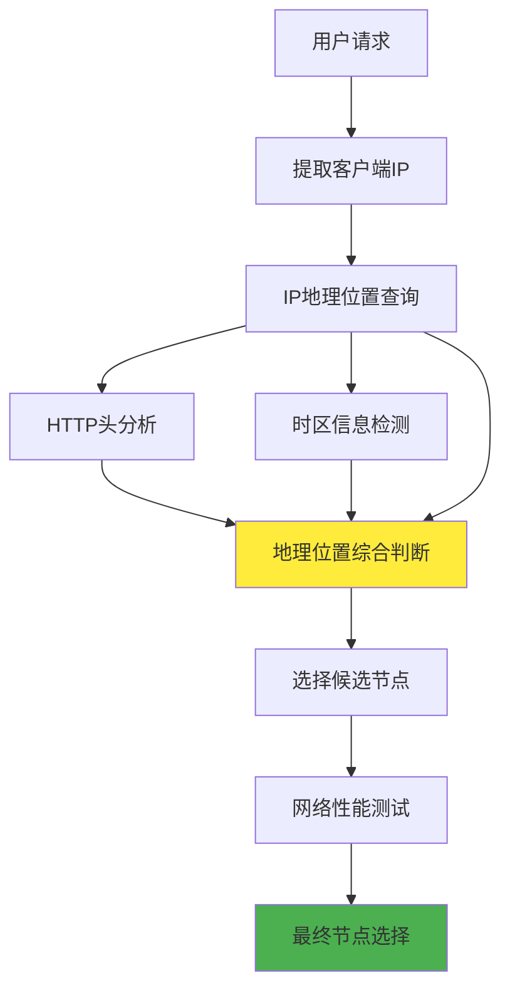
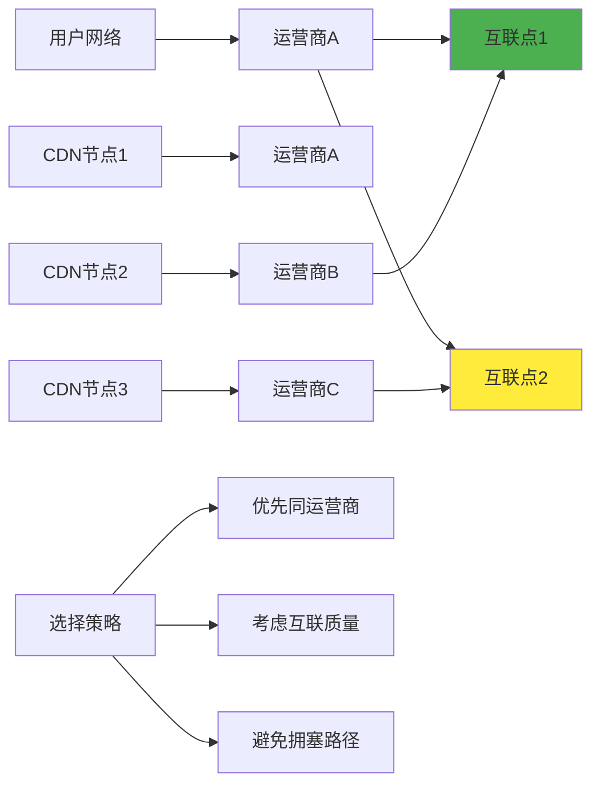
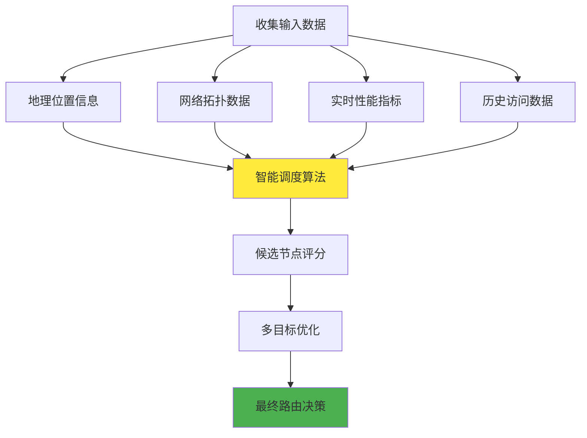

# 5.8.4 怎样知道哪个服务器IP地址离调用方"最近"

在CDN系统中，确定哪个服务器离用户最近是一个复杂的技术问题。这里的"最近"不仅仅指地理距离，更重要的是网络距离和访问性能。CDN需要综合考虑多个因素来做出最优的路由决策，这个过程涉及地理位置检测、网络拓扑分析、实时性能监控等多种技术手段。

## 地理位置检测技术

地理位置检测是CDN智能调度的基础。最常用的方法是基于IP地址的地理位置数据库，如MaxMind GeoIP、IP2Location等。这些数据库维护着IP地址段与地理位置的映射关系，可以根据用户的IP地址快速确定其大致的地理位置。

但是，IP地理位置数据库存在一定的局限性。首先是精度问题，特别是对于移动网络和代理服务器，定位精度可能较低。其次是更新滞后问题，IP地址的分配和使用会发生变化，数据库需要定期更新才能保持准确性。

为了提高定位精度，现代CDN系统还会结合其他技术手段。例如，通过分析HTTP请求头中的Accept-Language字段来推断用户的地理位置，或者使用JavaScript获取用户的时区信息作为辅助判断。

## 网络拓扑分析

地理距离并不等同于网络距离。两个地理位置相近的点，在网络上可能需要经过很长的路径才能到达。因此，CDN需要深入分析网络拓扑结构，了解不同网络之间的连接关系和性能特征。

自治系统（AS）是互联网的基本组织单位，每个AS都有自己的路由策略和网络特征。CDN会维护一个详细的AS数据库，记录不同AS之间的连接关系、带宽容量、延迟特征等信息。通过分析用户所在的AS和CDN节点所在的AS之间的关系，可以更准确地预测网络性能。

运营商网络的特征也是重要的考虑因素。不同运营商之间的互联质量差异很大，同一运营商内部的网络通常具有更好的连通性和性能。CDN会根据用户的运营商信息，优先选择同一运营商或者互联质量较好的节点。

## 实时性能监控

静态的地理位置和网络拓扑信息只能提供基础的判断依据，真正的网络性能是动态变化的。CDN需要实时监控各个节点的性能状况，包括延迟、丢包率、带宽利用率等指标，并将这些信息纳入路由决策过程。

CDN通常会部署大量的监控探针，定期从不同位置向各个节点发送测试请求，测量实际的网络性能。这些探针可能是专门的监控服务器，也可能是集成在边缘节点中的监控模块。通过收集大量的实时性能数据，CDN可以构建一个动态的网络性能地图。

用户的实际访问数据也是重要的性能指标来源。CDN会分析用户的访问日志，统计不同用户群体访问不同节点的性能表现，并将这些统计结果用于优化路由策略。这种基于真实用户体验的优化方法，通常能够获得更好的效果。

## 智能调度算法

综合所有的信息后，CDN需要使用智能调度算法来做出最终的路由决策。这个算法需要在多个目标之间进行权衡，包括访问延迟、负载均衡、成本控制、可用性保证等。

最简单的调度策略是基于地理位置的就近选择，但这种策略往往不够精确。更先进的算法会使用机器学习技术，通过分析历史数据来预测不同路由选择的性能表现。这些算法可以自动学习网络的特征和变化模式，不断优化路由决策。

一些CDN还会使用多目标优化算法，同时考虑多个性能指标。例如，在保证延迟不超过某个阈值的前提下，尽量选择负载较低的节点；或者在多个性能相近的节点中，选择成本最低的节点。

## 动态调整机制

网络环境是不断变化的，CDN的路由策略也需要能够动态调整。当检测到网络拥塞、节点故障或者性能下降时，系统需要能够快速调整路由策略，将流量切换到其他更合适的节点。

这种动态调整通常通过DNS TTL（生存时间）来实现。CDN会设置较短的DNS TTL，使得DNS记录能够快速更新。当需要调整路由时，CDN会修改DNS响应，将新的IP地址返回给用户。虽然DNS缓存可能会导致一定的延迟，但大部分用户能够在几分钟内切换到新的节点。

对于更加实时的调整需求，CDN还可能使用HTTP重定向、Anycast路由等技术。这些技术能够实现秒级甚至毫秒级的流量切换，但实现复杂度也相应增加。

## 边缘计算的影响

随着边缘计算技术的发展，CDN的节点选择策略也在发生变化。传统的CDN主要关注内容缓存和传输性能，而边缘计算CDN还需要考虑计算资源的分配和调度。

不同的边缘节点可能具有不同的计算能力，包括CPU性能、内存容量、GPU加速等。当用户的请求需要进行边缘计算时，CDN需要选择既能提供良好网络性能，又具备足够计算能力的节点。

这种多维度的优化使得节点选择变得更加复杂，但也为用户提供了更好的服务体验。例如，图片处理、视频转码、AI推理等计算密集型任务可以在边缘节点完成，减少了与源站的交互，提升了响应速度。

## 测量和验证方法

为了验证节点选择的效果，CDN需要建立完善的测量和验证机制。这包括主动测量和被动测量两种方式。

主动测量是指CDN主动发起测试请求，测量不同路径的性能表现。这种方法可以获得准确的性能数据，但会产生额外的网络流量。被动测量是指分析真实用户的访问数据，从中提取性能信息。这种方法不会产生额外流量，但数据的完整性和准确性可能受到限制。

A/B测试是另一种重要的验证方法。CDN可以将用户分成不同的组，使用不同的路由策略，然后比较各组的性能表现。通过这种方法，可以验证新的调度算法是否真正带来了性能提升。

## 挑战和局限性

尽管CDN在节点选择方面已经相当成熟，但仍然面临一些挑战和局限性。首先是数据的准确性和时效性问题，网络环境的快速变化使得静态数据很快就会过时。其次是计算复杂度问题，实时的智能调度需要处理大量的数据和计算，对系统性能提出了很高的要求。

隐私保护也是一个重要的考虑因素。为了实现精确的地理位置检测和个性化服务，CDN需要收集和分析用户的各种信息。如何在提供优质服务的同时保护用户隐私，是CDN服务商需要平衡的问题。

最后，不同地区的网络基础设施差异很大，CDN的节点选择策略需要适应这种差异。在网络基础设施较为落后的地区，可能需要采用不同的优化策略和技术方案。

通过理解CDN如何确定最近的服务器，我们可以更好地理解CDN的工作原理，也能够在实际应用中做出更明智的配置和优化决策。这种理解对于网络应用的性能优化和问题诊断都具有重要的价值。

---

*本文档为《网络101》系列的一部分*
