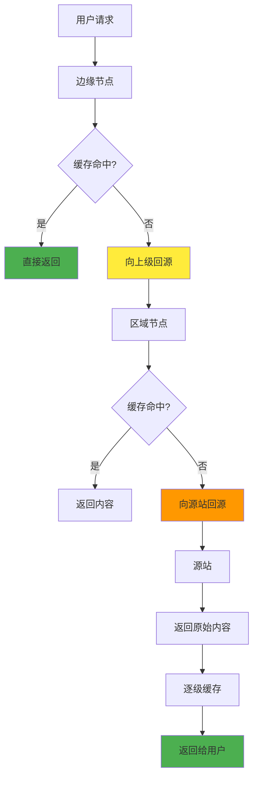
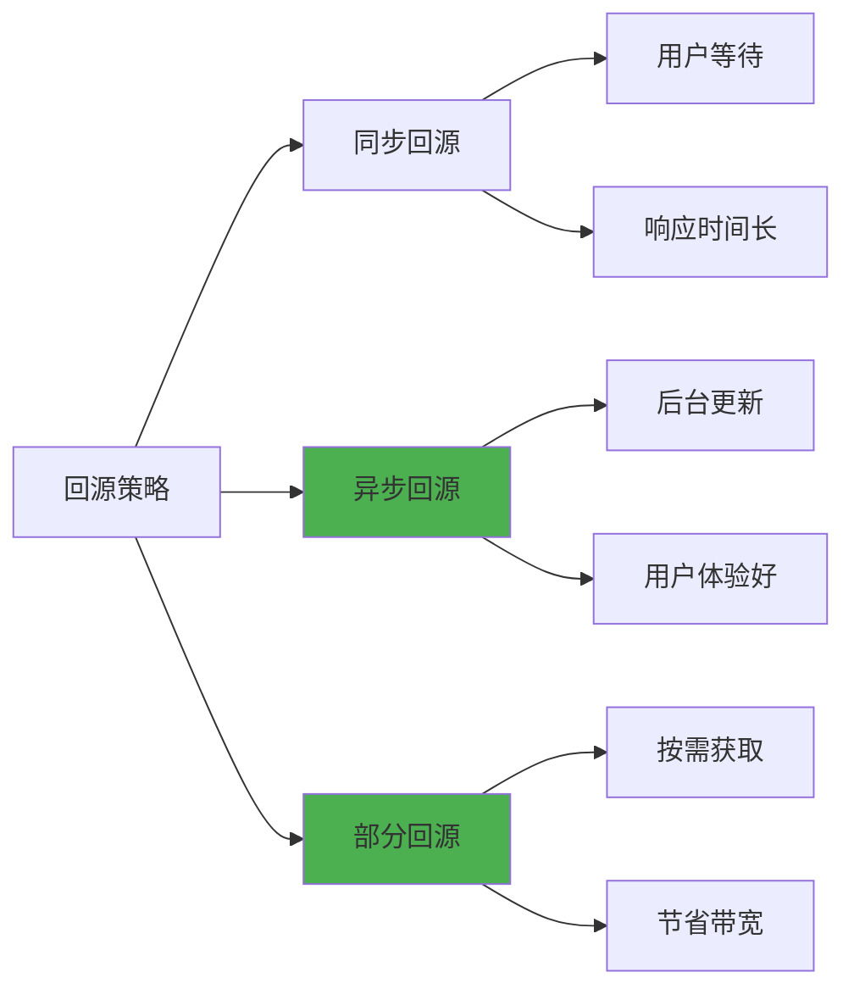
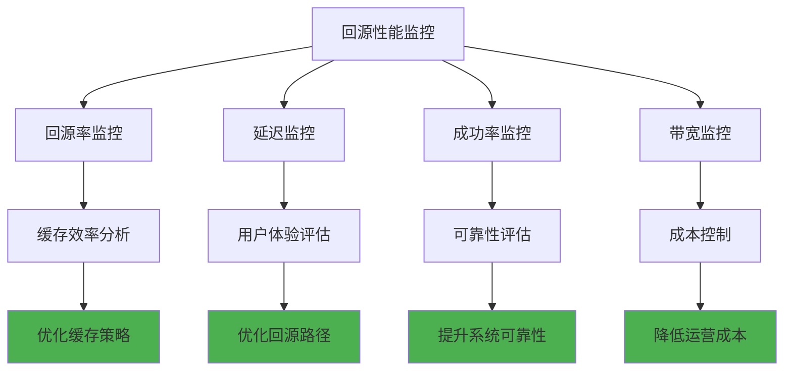

# 5.8.5 回源是什么

回源是CDN系统中的一个核心概念，指的是当CDN边缘节点无法满足用户请求时，需要向上级节点或源站请求内容的过程。这个看似简单的概念背后，实际上涉及复杂的缓存策略、网络架构和性能优化技术。理解回源机制对于优化CDN性能、控制成本和提升用户体验都具有重要意义。

## 回源的基本概念

在CDN的分层架构中，内容从源站开始，逐级分发到各个边缘节点。当用户请求某个资源时，CDN首先会在最近的边缘节点查找该资源。如果边缘节点有缓存且未过期，就直接返回给用户，这称为缓存命中。如果边缘节点没有缓存或缓存已过期，就需要向上级获取内容，这个过程就是回源。

回源可能发生在多个层级。边缘节点可能向区域节点回源，区域节点可能向中心节点回源，最终可能需要向源站回源。这种分层的回源机制既保证了内容的可用性，又通过多级缓存减少了对源站的压力。

回源不仅仅是简单的内容获取，还涉及缓存策略的执行、内容验证、错误处理等多个方面。CDN需要智能地决定何时回源、向哪里回源、如何处理回源失败等问题。

## 回源触发条件

回源的触发条件多种多样，理解这些条件有助于优化CDN的配置和使用策略。最常见的触发条件是缓存未命中，即请求的内容在当前节点不存在。这通常发生在内容首次被请求时，或者内容被清理后再次被请求时。

缓存过期是另一个重要的触发条件。每个缓存内容都有一个生存时间（TTL），当TTL到期后，即使内容仍然存在于节点上，也需要回源验证内容是否有更新。这种机制确保了用户获取的内容是最新的。

内容验证失败也会触发回源。CDN可能会定期验证缓存内容的完整性，如果发现内容损坏或不完整，就需要重新从源站获取。此外，当源站返回特定的HTTP状态码（如304 Not Modified）时，也可能触发不同类型的回源行为。

用户的特殊请求也可能绕过缓存直接回源。例如，带有特定查询参数的请求、包含特殊HTTP头的请求，或者来自特定用户群体的请求，可能被配置为不使用缓存，直接回源获取最新内容。

## 回源策略和优化

不同的回源策略会显著影响CDN的性能和成本。最简单的策略是同步回源，即当需要回源时，立即向上级或源站请求内容，用户等待直到内容获取完成。这种策略简单可靠，但可能导致较长的响应时间。

异步回源是一种更高级的策略，当检测到内容即将过期时，CDN会在后台预先回源更新内容，而不是等到用户请求时才回源。这种策略可以显著减少用户感知的延迟，但会增加带宽消耗和系统复杂度。

部分回源是针对大文件的优化策略。对于视频、软件包等大文件，CDN可能只回源用户实际需要的部分，而不是整个文件。这种策略通过HTTP Range请求实现，可以大大减少回源的数据量和时间。

## 回源路径选择

在多层CDN架构中，选择合适的回源路径对性能至关重要。最直接的方式是直接向源站回源，这样可以确保获取最新的内容，但可能会给源站带来较大压力，特别是在流量高峰期。

分层回源是更常见的策略，边缘节点首先向区域节点回源，只有当区域节点也没有内容时，才向源站回源。这种策略可以有效分散源站压力，但可能增加回源的跳数和延迟。

智能回源路径选择会根据网络状况、节点负载、内容特征等因素动态选择最优的回源路径。例如，对于热门内容，可能优先从负载较低的区域节点回源；对于冷门内容，可能直接从源站回源以减少延迟。

多源回源是一种高可用性策略，CDN会配置多个源站或上级节点，当主要回源路径失败时，自动切换到备用路径。这种策略提高了系统的可靠性，但也增加了配置和管理的复杂度。

## 回源性能监控

回源性能的监控对于CDN运营至关重要。关键的监控指标包括回源率、回源延迟、回源成功率、回源带宽消耗等。回源率反映了缓存效率，过高的回源率可能表明缓存策略需要优化。

回源延迟直接影响用户体验，特别是对于动态内容和实时应用。CDN需要监控不同回源路径的延迟分布，识别性能瓶颈并进行优化。回源成功率反映了系统的可靠性，频繁的回源失败可能表明源站或网络存在问题。

回源带宽消耗关系到运营成本，特别是对于大流量的应用。通过监控回源带宽的使用模式，可以优化缓存策略，减少不必要的回源，降低成本。

## 回源失败处理

回源失败是CDN运营中不可避免的问题，需要有完善的处理机制。常见的失败原因包括源站不可用、网络连接问题、内容不存在、权限验证失败等。针对不同的失败原因，CDN需要采取不同的处理策略。

对于临时性的网络问题，CDN通常会实施重试机制，在短时间内多次尝试回源。重试策略需要平衡成功率和响应时间，避免过度重试导致的延迟累积。指数退避是常用的重试策略，每次重试的间隔时间逐渐增加。

当主要回源路径失败时，CDN可以尝试备用路径，如切换到其他源站或通过不同的网络路径回源。这种故障转移机制可以提高系统的可用性，但需要预先配置好备用资源。

对于持续性的回源失败，CDN可能需要返回缓存的旧版本内容，或者返回预设的错误页面。这种降级策略虽然不能提供最新的内容，但可以保证基本的服务可用性。

## 回源安全考虑

回源过程中的安全问题不容忽视。首先是源站的身份验证，CDN需要确保回源请求发送到正确的源站，避免DNS劫持或中间人攻击。通常通过HTTPS、证书验证等方式来保证回源连接的安全性。

内容完整性验证也很重要，CDN需要验证回源获取的内容是否完整和正确。可以通过校验和、数字签名等方式来验证内容的完整性，防止内容在传输过程中被篡改。

访问控制是另一个重要方面，源站可能需要对回源请求进行身份验证和授权。CDN需要正确处理各种认证机制，如API密钥、OAuth令牌、IP白名单等。

防止回源攻击也需要考虑，恶意用户可能通过构造特殊请求来触发大量回源，对源站造成压力。CDN需要实施适当的限流和防护机制，识别和阻止异常的回源请求。

## 回源成本优化

回源成本是CDN运营的重要考虑因素，包括带宽成本、计算成本和存储成本。优化回源策略可以显著降低这些成本。首先是提高缓存命中率，通过优化缓存策略、预热热门内容、延长合适内容的TTL等方式减少回源频率。

内容压缩可以减少回源的数据传输量，降低带宽成本。CDN可以在回源时请求压缩版本的内容，或者在回源后对内容进行压缩存储。但需要平衡压缩带来的CPU开销和带宽节省。

智能预取是另一种优化策略，通过分析用户访问模式，预测可能被请求的内容并提前回源缓存。这种策略可以提高缓存命中率，但需要准确的预测算法以避免无效的预取。

回源时间优化也很重要，选择网络状况较好的时间段进行批量回源，可以提高回源效率并降低成本。例如，在网络流量较低的深夜时段进行大文件的回源和缓存更新。

## 新技术对回源的影响

随着技术的发展，回源机制也在不断演进。边缘计算的兴起使得CDN节点不仅仅是内容缓存，还可以进行内容生成和处理。这种情况下，回源可能不是获取静态内容，而是获取数据或代码来进行边缘计算。

HTTP/3和QUIC协议的普及可能会改变回源的网络特性，提供更好的性能和可靠性。这些新协议的多路复用、连接迁移等特性可以优化回源的网络传输。

人工智能和机器学习技术正在被应用到回源优化中，通过分析历史数据和实时状况，智能预测回源需求，优化回源策略。这些技术可以实现更精准的缓存管理和更高效的回源决策。

容器化和微服务架构也在影响CDN的设计，使得回源服务可以更灵活地部署和扩展。这种架构可以支持更复杂的回源逻辑和更精细的性能优化。

通过深入理解回源机制，我们可以更好地设计和优化CDN系统，提供更好的用户体验和更高的运营效率。回源虽然是CDN的基础功能，但其优化空间巨大，值得持续关注和改进。

---

*本文档为《网络101》系列的一部分*
