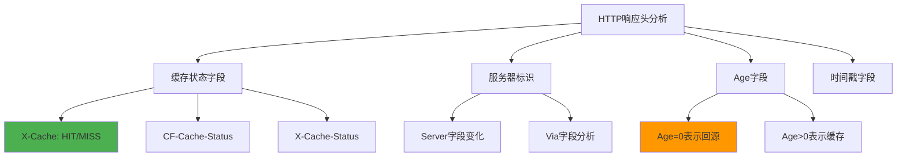
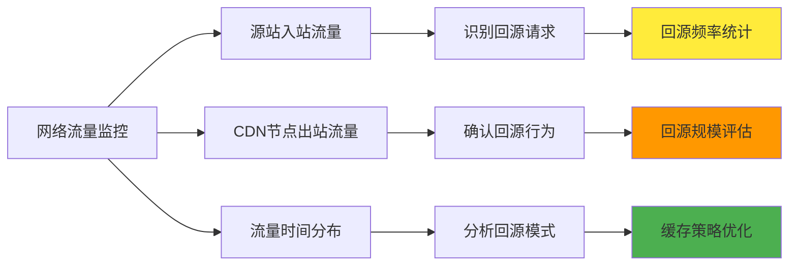
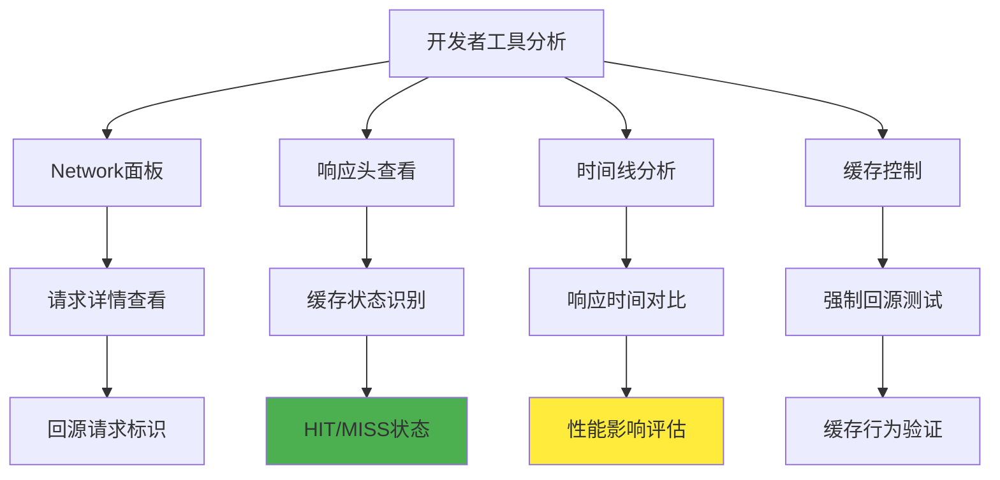

# 5.8.6 怎样判断是否发生回源

判断CDN是否发生回源是网络性能分析和故障诊断的重要技能。回源的发生直接影响用户体验和系统性能，因此准确识别回源行为对于优化CDN配置、分析性能问题和控制成本都具有重要意义。本节将介绍多种判断回源的方法和工具，帮助读者掌握这一关键技能。

## HTTP响应头分析

HTTP响应头是判断回源最直接和可靠的方法。CDN服务商通常会在响应头中添加特定的字段来标识请求的处理状态。最常见的是缓存状态字段，如X-Cache、X-Cache-Status、CF-Cache-Status等，这些字段会明确指示请求是命中缓存（HIT）还是回源获取（MISS）。

除了缓存状态，响应头中的服务器标识也能提供有价值的信息。当请求命中CDN缓存时，Server字段通常显示CDN服务商的标识；而回源时，可能会显示源站服务器的信息，或者CDN会添加额外的字段来标识回源行为。

Age字段是另一个重要的指标，它表示内容在缓存中存在的时间。如果Age值为0或很小，通常表示内容是刚刚从源站获取的，即发生了回源。相反，较大的Age值表示内容已经在缓存中存在一段时间。

## 响应时间分析

响应时间是判断回源的重要指标。缓存命中的响应时间通常很短，因为内容直接从边缘节点返回，网络延迟最小。而回源请求需要从源站获取内容，响应时间会显著增加，特别是当源站距离较远或网络状况不佳时。

通过监控响应时间的分布和变化模式，可以识别回源行为。如果某个资源的响应时间突然增加，可能表示发生了回源。对于同一资源的多次请求，第一次请求通常响应时间较长（回源），后续请求响应时间较短（缓存命中）。

需要注意的是，响应时间受多种因素影响，包括网络状况、服务器负载、内容大小等。因此，单纯依靠响应时间判断回源可能不够准确，需要结合其他指标进行综合分析。

## 网络流量监控

网络流量监控可以从另一个角度判断回源行为。当CDN节点向源站回源时，会产生从CDN到源站的网络流量。通过监控源站的入站流量，可以识别回源请求的模式和频率。

流量监控不仅可以识别是否发生回源，还可以分析回源的规模和影响。大量的回源流量可能表示缓存策略存在问题，或者遇到了缓存失效的情况。通过分析流量的时间分布，可以了解回源的触发模式，如定期的缓存更新、突发的流量峰值等。

现代网络监控工具提供了丰富的流量分析功能，可以按照源IP、目标IP、端口、协议等维度进行分析。这些工具可以帮助识别CDN节点的IP地址，从而准确判断哪些流量是回源产生的。

## 日志分析方法

CDN和源站的访问日志包含了丰富的信息，是判断回源的重要数据源。CDN的日志通常会记录每个请求的处理状态，包括是否命中缓存、回源时间、响应状态等。通过分析这些日志，可以准确识别回源行为。

源站的访问日志也很有价值，特别是当需要从源站角度分析回源行为时。源站日志中的User-Agent字段通常会包含CDN的标识，通过这个字段可以区分来自CDN的回源请求和直接的用户请求。

日志分析需要使用适当的工具和方法。简单的文本处理工具如grep、awk可以进行基础的日志筛选和统计。更复杂的分析可能需要使用专门的日志分析工具，如ELK Stack（Elasticsearch、Logstash、Kibana）、Splunk等。

正则表达式是日志分析的重要工具，可以用来提取特定的信息模式。例如，可以使用正则表达式来匹配特定的缓存状态标识、IP地址范围、时间戳格式等。

## 开发者工具使用

现代浏览器的开发者工具提供了强大的网络分析功能，是判断回源的便捷工具。在Network面板中，可以查看每个请求的详细信息，包括响应头、响应时间、内容大小等。

通过开发者工具，可以实时观察网页加载过程中的网络请求，识别哪些请求可能触发了回源。对于同一资源的重复请求，可以比较它们的响应时间和响应头，判断缓存状态的变化。

开发者工具还支持网络条件模拟，可以模拟不同的网络环境来测试CDN的行为。通过禁用缓存、刷新页面等操作，可以强制触发回源，观察系统的响应。

一些浏览器扩展和第三方工具也提供了专门的CDN分析功能，可以自动识别和标记回源请求，提供更直观的分析界面。

## 自动化监控工具

对于生产环境的CDN监控，手动分析往往不够高效，需要使用自动化监控工具。这些工具可以持续监控CDN的性能和行为，自动识别回源事件，并提供告警和报告功能。

专业的CDN监控服务如Pingdom、GTmetrix、WebPageTest等，提供了全球多点的监控能力，可以从不同地理位置测试CDN的性能，识别回源行为的地域差异。

自建监控系统可以提供更灵活的监控策略。通过编写脚本定期请求特定资源，分析响应头和响应时间，可以实现自定义的回源检测逻辑。这种方法特别适合对特定业务场景的深度监控。

监控工具通常提供丰富的可视化功能，可以生成回源率趋势图、响应时间分布图、地理位置热力图等，帮助直观地理解CDN的行为模式。

## 性能指标关联分析

回源行为往往与其他性能指标存在关联关系，通过综合分析多个指标可以更准确地判断回源。例如，回源通常伴随着响应时间增加、带宽使用量变化、错误率波动等。

缓存命中率是最直接的相关指标，回源率和缓存命中率呈反比关系。通过监控缓存命中率的变化，可以间接判断回源行为的变化趋势。

用户体验指标如页面加载时间、首字节时间（TTFB）等，也会受到回源行为的影响。当回源增加时，这些指标通常会恶化。通过建立这些指标之间的关联模型，可以实现更智能的回源检测。

成本指标也是重要的关联因素，回源会增加带宽成本和源站负载。通过监控成本变化，可以从经济角度评估回源的影响。

## 故障诊断场景

在实际的故障诊断中，判断回源往往是解决问题的关键步骤。当用户报告网站访问缓慢时，首先需要判断是否由于回源增加导致的性能下降。

常见的故障场景包括缓存失效导致的大量回源、源站故障导致的回源失败、网络问题导致的回源延迟等。针对不同的故障类型，需要采用不同的诊断方法和工具。

故障诊断通常需要快速定位问题，因此需要预先准备好监控工具和分析脚本。建立标准的诊断流程，包括检查响应头、分析日志、监控流量等步骤，可以提高故障处理的效率。

文档记录也很重要，记录每次故障的诊断过程和结果，可以积累经验，提高未来故障处理的准确性和速度。

## 预防性监控策略

除了被动地检测回源，更重要的是建立预防性监控策略，提前发现可能导致回源增加的问题。这包括监控缓存配置的变化、源站性能的波动、网络状况的异常等。

设置合适的告警阈值是预防性监控的关键。当回源率超过正常范围、响应时间异常增加、或者出现大量回源失败时，系统应该及时发出告警，通知运维人员进行处理。

定期的性能评估也是预防性策略的重要组成部分。通过定期分析CDN的性能数据，可以识别潜在的问题趋势，在问题严重化之前采取预防措施。

建立基线是预防性监控的基础，通过收集正常情况下的性能数据，建立性能基线，可以更准确地识别异常情况。基线应该考虑业务的周期性变化，如日常流量波动、季节性变化等。

通过掌握这些判断回源的方法和技能，可以更好地管理和优化CDN系统，确保为用户提供最佳的访问体验。回源检测不仅是技术问题，也是业务优化的重要工具，值得深入学习和实践。

---

*本文档为《网络101》系列的一部分*
