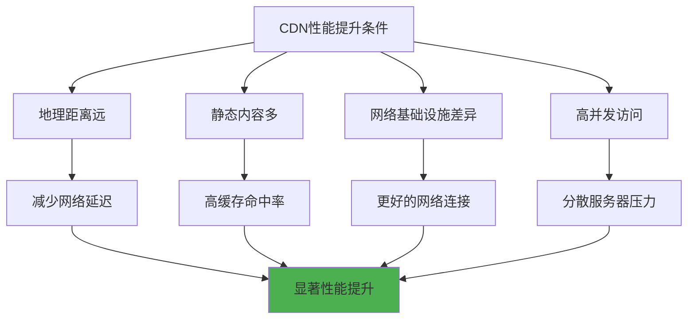
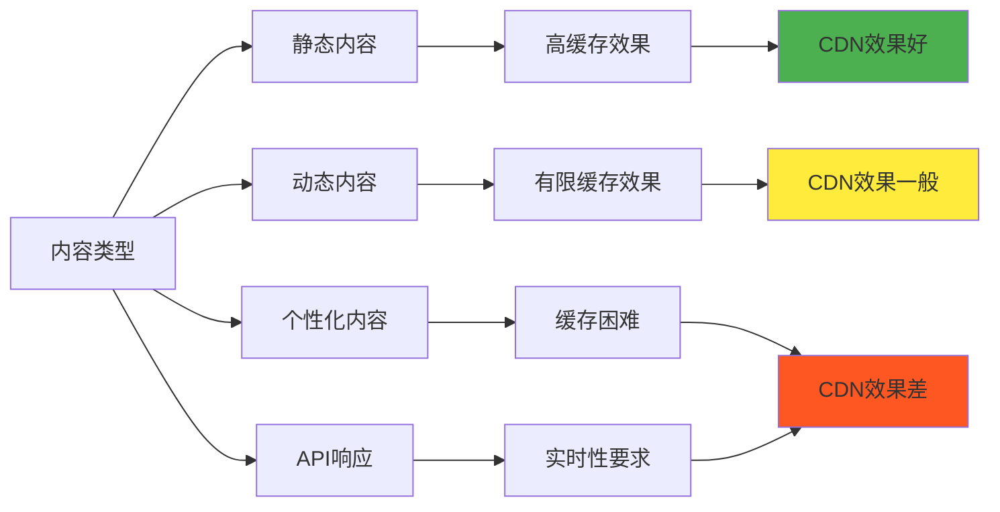
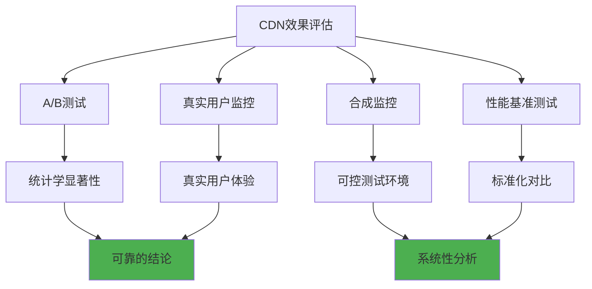

# 5.8.7 用了CDN一定比不用更快吗

这是一个看似简单但实际上相当复杂的问题。虽然CDN的设计初衷是提升网站性能，但在实际应用中，CDN并不总是能带来性能提升，有时甚至可能降低性能。理解CDN在什么情况下有效，什么情况下可能适得其反，对于做出正确的技术决策至关重要。

## CDN提升性能的理想条件

CDN能够显著提升性能的前提条件相当明确。首先是地理距离因素，当用户与源站之间的物理距离较远时，CDN的边缘节点可以大幅减少网络延迟。例如，一个位于美国的网站服务中国用户时，通过部署在中国的CDN节点，可以将延迟从几百毫秒降低到几十毫秒。

内容类型也是重要因素。静态内容如图片、CSS、JavaScript文件、视频等最适合CDN缓存，因为这些内容变化频率低，可以长时间缓存在边缘节点。对于这类内容，CDN的缓存命中率通常很高，能够显著减少回源请求。

网络基础设施的质量差异也会影响CDN的效果。在网络基础设施相对落后的地区，CDN提供商通常拥有更好的网络连接和带宽资源，可以提供比直连源站更好的网络性能。

## CDN可能降低性能的场景

然而，在某些情况下，CDN可能会降低而不是提升性能。最常见的情况是当用户已经很接近源站时，额外的CDN层级可能会增加延迟。如果CDN节点的性能不如源站，或者网络连接质量较差，用户的访问体验可能会变差。

缓存未命中是另一个重要因素。当请求的内容不在CDN缓存中时，需要回源获取，这个过程可能比直接访问源站更慢。特别是对于动态内容或个性化内容，缓存命中率很低，CDN的价值就大打折扣。

DNS解析的额外开销也不容忽视。使用CDN通常需要额外的DNS查询来确定最佳的边缘节点，这个过程会增加一定的延迟。虽然DNS缓存可以减少这种影响，但对于首次访问的用户，这种延迟是不可避免的。

配置不当是导致CDN性能下降的常见原因。错误的缓存策略、不合适的TTL设置、缺乏预热机制等都可能导致CDN无法发挥应有的作用，甚至产生负面影响。

## 动态内容的挑战

动态内容是CDN面临的最大挑战之一。传统的CDN主要针对静态内容设计，对于需要实时生成的动态内容，缓存效果有限。虽然现代CDN提供了边缘计算、动态内容优化等功能，但这些技术的效果很大程度上取决于具体的应用场景和实现方式。

个性化内容更是难题，每个用户看到的内容都不同，传统的缓存策略几乎无效。虽然可以通过ESI（Edge Side Includes）、动态内容组装等技术来部分解决这个问题，但复杂度和成本都会显著增加。

API请求通常也不适合传统的CDN缓存，因为API响应往往是实时的、个性化的。虽然可以对某些API进行短时间缓存，但需要仔细权衡数据一致性和性能之间的关系。

## 网络环境的影响

网络环境对CDN效果的影响不容小觑。在网络状况良好的环境中，直连源站的性能可能已经足够好，CDN的提升空间有限。相反，在网络状况较差的环境中，CDN的价值更加明显。

运营商网络的特性也会影响CDN的效果。不同运营商之间的互联质量差异很大，如果CDN节点与用户不在同一运营商网络内，可能会经过质量较差的互联链路，导致性能下降。

网络拥塞是另一个重要因素。在网络高峰期，CDN节点可能会遇到带宽瓶颈或处理能力不足的问题，这时CDN的性能可能不如预期。

移动网络环境更加复杂，信号强度、基站负载、网络切换等因素都会影响CDN的效果。在某些情况下，移动网络的不稳定性可能会放大CDN配置不当带来的问题。

## 成本效益分析

除了技术性能，成本效益也是评估CDN价值的重要维度。CDN服务通常按流量或请求数收费，对于流量较小的网站，CDN的成本可能超过其带来的收益。

维护成本也需要考虑，使用CDN需要额外的配置、监控、故障处理等工作，这些都会增加运营成本。对于技术团队规模较小的组织，这种额外的复杂性可能得不偿失。

机会成本同样重要，投入CDN的资源是否可以用于其他更有价值的优化，如数据库优化、代码优化、服务器升级等，需要综合考虑。

## 测量和评估方法

要准确判断CDN是否真正提升了性能，需要建立科学的测量和评估方法。简单的响应时间对比可能不够准确，因为网络状况、用户行为、内容特征等因素都在不断变化。

A/B测试是比较可靠的评估方法，通过将用户分成两组，一组使用CDN，另一组直连源站，然后比较两组的性能指标。但这种方法需要足够的流量和时间来获得统计学上显著的结果。

真实用户监控（RUM）可以提供更真实的性能数据，通过在网页中嵌入监控代码，收集真实用户的访问数据。这种方法可以反映不同地区、不同网络环境下的真实性能表现。

合成监控可以提供更可控的测试环境，通过模拟用户访问来测试CDN的性能。虽然不如真实用户数据准确，但可以进行更系统的性能对比。

## 优化策略和最佳实践

要最大化CDN的效果，需要采用合适的优化策略。首先是内容分类，将适合缓存的静态内容和不适合缓存的动态内容分开处理，为不同类型的内容制定不同的CDN策略。

缓存策略优化是关键，需要根据内容的更新频率、重要性、访问模式等因素来设置合适的TTL。过短的TTL会导致频繁回源，过长的TTL可能导致内容过期。

预热策略可以提高缓存命中率，在内容发布或更新后，主动将内容推送到CDN节点，避免用户首次访问时的回源延迟。

监控和调优是持续的过程，需要定期分析CDN的性能数据，识别问题并进行优化。这包括调整缓存策略、优化回源路径、处理热点问题等。

## 替代方案考虑

在某些情况下，可能存在比CDN更好的替代方案。服务器端优化如代码优化、数据库优化、缓存优化等，可能比CDN带来更显著的性能提升。

多区域部署是另一种选择，通过在不同地区部署服务器，可以实现类似CDN的地理分布效果，但具有更好的控制性和灵活性。

云服务提供商的全球基础设施也可以作为替代方案，通过使用云服务商的全球网络，可以获得类似CDN的性能提升，同时简化架构复杂度。

边缘计算平台提供了更强大的功能，不仅可以缓存静态内容，还可以在边缘执行计算逻辑，处理动态内容和个性化需求。

## 决策框架

建立科学的决策框架有助于判断是否应该使用CDN。首先需要分析业务需求，包括用户分布、内容特征、性能要求、成本预算等因素。

技术评估包括现有架构分析、性能瓶颈识别、CDN适配性评估等。需要客观地评估CDN能够解决哪些问题，以及可能带来哪些新的挑战。

试点测试是降低风险的有效方法，可以先在小范围内测试CDN的效果，验证预期的性能提升，然后再决定是否全面部署。

持续评估机制确保CDN的价值能够持续体现，随着业务发展和技术环境变化，需要定期重新评估CDN的效果和必要性。

总的来说，CDN并不是万能的性能提升方案，其效果很大程度上取决于具体的应用场景、配置方式和使用策略。只有在充分理解CDN的优势和局限性的基础上，才能做出正确的技术决策，真正发挥CDN的价值。

---

*本文档为《网络101》系列的一部分*
