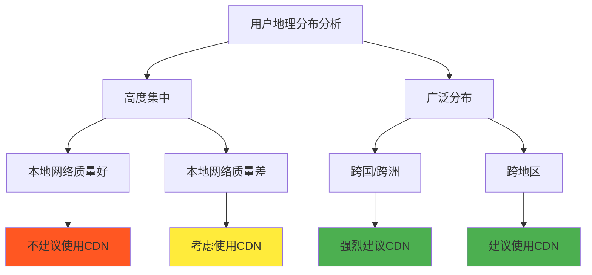
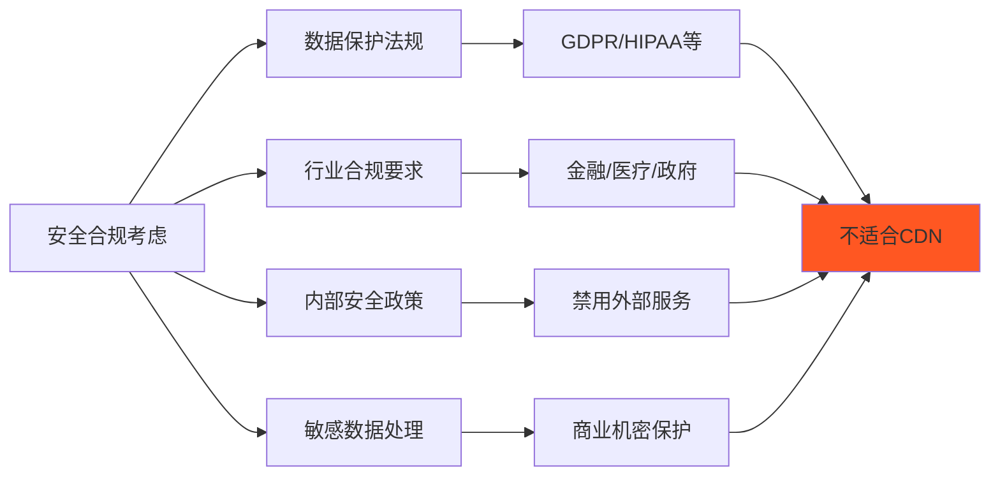
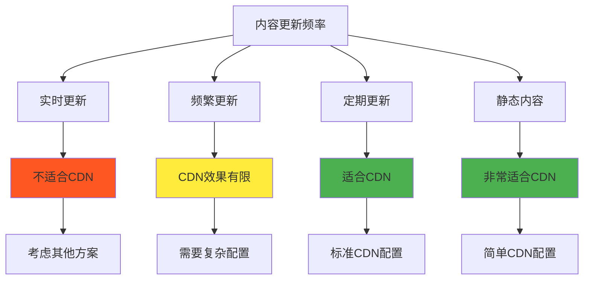

# 5.8.8 什么情况下不应该使用CDN

虽然CDN在很多场景下都能带来显著的性能提升，但并非所有情况都适合使用CDN。错误地使用CDN不仅可能无法改善性能，还可能增加系统复杂度、提高成本，甚至带来安全风险。理解什么时候不应该使用CDN，对于做出正确的架构决策同样重要。

## 地理位置集中的用户群体

当网站的用户群体高度集中在某个地理区域，且该区域已经有高质量的网络基础设施时，CDN的价值就会大打折扣。例如，一个只服务本地用户的城市门户网站，如果服务器就部署在同一城市的高质量数据中心，用户访问延迟本身就很低，CDN带来的改善可能微乎其微。

在这种情况下，CDN不仅无法显著提升性能，还会增加额外的DNS解析时间和可能的网络跳转。用户的请求需要先到CDN节点，如果CDN节点的性能不如源站，或者网络路径更复杂，反而可能降低整体性能。

特别是对于企业内网应用，用户都在同一网络环境内，网络延迟和带宽通常都不是瓶颈，CDN的地理分布优势完全无法发挥。这种情况下，投资CDN的资源可能更适合用于服务器性能优化或应用程序优化。

## 高度动态和个性化的内容

CDN的核心价值在于缓存，但对于高度动态和个性化的内容，传统的缓存策略几乎无效。如果网站的内容主要是实时生成的、个性化的，或者需要频繁更新的，CDN可能无法提供有效的缓存，反而会增加系统的复杂度。

社交媒体的个人时间线、个性化推荐系统、实时聊天应用等都属于这类场景。每个用户看到的内容都不同，而且内容更新频繁，传统的CDN缓存策略难以发挥作用。虽然现代CDN提供了边缘计算功能，但这通常需要大量的定制开发和配置工作。

金融交易系统、实时数据分析平台等对数据一致性要求极高的应用，也不适合使用传统CDN。这些系统需要确保用户获取的数据是最新的、准确的，任何缓存都可能导致数据不一致的问题。

API密集型应用也面临类似的挑战，特别是那些需要用户认证、权限控制的API。这些API的响应通常是个性化的，缓存价值有限，而且可能带来安全风险。

## 安全和合规要求严格的场景

某些行业和应用对数据安全和合规性有严格要求，使用第三方CDN可能会带来合规风险。金融服务、医疗健康、政府机构等行业通常有严格的数据处理和存储规定，要求数据不能离开特定的地理区域或必须使用特定的安全措施。

使用CDN意味着将内容分发到全球各地的节点，这可能违反某些数据保护法规，如GDPR、HIPAA等。即使CDN提供商声称符合相关法规，但在实际审计和合规检查中，使用第三方服务仍然可能带来额外的复杂性和风险。

对于包含敏感信息的内容，如用户个人数据、商业机密、技术文档等，通过CDN分发可能增加数据泄露的风险。虽然现代CDN提供了各种安全措施，但任何额外的中间环节都会增加潜在的攻击面。

某些组织的安全政策可能禁止使用外部服务，要求所有数据处理都在内部网络中进行。在这种情况下，即使CDN能带来性能提升，也无法使用。

## 成本效益不匹配的情况

对于流量较小的网站或应用，CDN的成本可能超过其带来的收益。CDN服务通常有最低消费要求，对于月流量只有几GB的小网站，这个成本可能比购买更好的服务器或优化现有系统更昂贵。

初创公司和小型项目在早期阶段通常需要控制成本，此时投资CDN的资源可能更适合用于产品开发、市场推广或其他更直接影响业务的方面。当用户基数还很小时，性能优化的优先级可能不如功能开发。

对于技术团队规模较小的组织，维护CDN配置、监控性能、处理故障等工作可能会占用大量时间和精力。这种情况下，简单的架构可能更适合，可以将有限的技术资源集中在核心业务逻辑上。

某些类型的应用，如内部工具、测试环境、开发环境等，用户对性能的要求不高，使用CDN的必要性很小。这些环境更注重功能性和开发效率，而不是最终用户体验。

## 技术架构不兼容的场景

某些技术架构或应用模式与CDN的工作方式不兼容。例如，使用WebSocket进行实时通信的应用，CDN对WebSocket的支持可能有限，或者会增加连接的复杂性。

基于长连接的应用，如某些游戏服务器、实时协作工具等，CDN的负载均衡和故障转移机制可能会干扰连接的稳定性。这些应用通常需要客户端与特定的服务器实例保持持久连接。

使用非标准协议或端口的应用也可能与CDN不兼容。虽然现代CDN支持多种协议，但对于一些专有协议或特殊端口配置，可能需要大量的定制工作。

某些应用依赖于客户端IP地址进行功能实现，如地理位置服务、访问控制等。使用CDN后，源站看到的是CDN节点的IP地址，而不是真实的客户端IP，这可能会影响应用的正常功能。

## 内容更新频繁的场景

对于内容更新非常频繁的网站，CDN的缓存机制可能成为负担而不是优势。新闻网站、股票交易平台、体育赛事直播等需要实时更新内容的应用，频繁的缓存失效和更新可能导致大量的回源请求。

内容管理系统（CMS）如果配置不当，可能会因为频繁的内容更新而导致CDN缓存效率低下。特别是那些允许用户实时编辑内容的协作平台，缓存策略的设计变得非常复杂。

电商网站的库存信息、价格信息等需要实时准确的数据，如果使用CDN缓存，可能会导致用户看到过期的信息，影响购买决策和用户体验。

社交媒体平台的用户生成内容（UGC）更新频繁，而且具有很强的时效性，传统的CDN缓存策略可能无法有效处理这种场景。

## 特殊网络环境的限制

在某些特殊的网络环境中，CDN可能无法正常工作或效果不佳。企业内网环境通常有严格的防火墙和网络策略，可能会阻止对外部CDN节点的访问。

某些国家或地区的网络管制政策可能会影响CDN的可用性。如果CDN提供商的节点被屏蔽或访问受限，不仅无法提升性能，还可能导致服务不可用。

移动网络环境的复杂性也可能影响CDN的效果。某些移动运营商的网络配置可能与CDN的路由策略不兼容，导致性能下降而不是提升。

专用网络或VPN环境中，网络路由可能不遵循常规的地理就近原则，CDN的智能调度可能无法正确工作。

## 决策建议和替代方案

在决定是否使用CDN时，需要综合考虑多个因素。首先要明确业务目标和用户需求，评估性能提升的重要性和紧迫性。如果用户主要关注功能而不是性能，或者现有性能已经足够好，可能不需要CDN。

成本效益分析是重要的决策依据，需要比较CDN的成本与预期收益。这不仅包括直接的服务费用，还包括实施、维护、监控等间接成本。

技术评估要考虑现有架构的兼容性、团队的技术能力、维护的复杂度等因素。如果引入CDN会显著增加系统复杂度，需要权衡复杂度与收益的关系。

对于不适合使用CDN的场景，可以考虑其他优化方案。服务器性能优化、数据库优化、代码优化、网络优化等都可能带来显著的性能提升。多区域部署、负载均衡、缓存优化等架构改进也是有效的替代方案。

边缘计算平台可能是某些场景下的更好选择，特别是对于需要处理动态内容或进行实时计算的应用。云服务提供商的全球基础设施也可以提供类似CDN的地理分布优势。

最重要的是要根据具体情况做出决策，避免盲目跟风或一刀切的做法。CDN是一个强大的工具，但只有在合适的场景下使用，才能真正发挥其价值。

---

*本文档为《网络101》系列的一部分*
