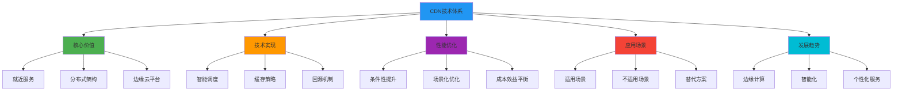

# 5.8.9 小结

通过对CDN技术的深入探讨，我们从多个维度理解了这项在现代互联网基础设施中扮演重要角色的技术。CDN不仅仅是一个简单的缓存系统，而是一个复杂的分布式网络架构，涉及DNS解析、智能路由、缓存策略、负载均衡、安全防护等多个技术层面。

## CDN的本质与价值

CDN的核心价值在于通过地理分布的节点网络，将内容推送到更接近用户的位置，从而减少网络延迟、提高访问速度、降低源站压力。这种"就近服务"的理念体现了分布式系统设计的基本原则，即通过空间换时间、通过冗余换可靠性。

从技术演进的角度看，CDN经历了从简单的静态内容缓存到支持动态内容、边缘计算的发展过程。现代CDN已经不仅仅是内容分发网络，更像是一个边缘云平台，能够在边缘节点执行计算任务、处理业务逻辑、提供安全防护等功能。

CDN的工作原理揭示了现代互联网架构的复杂性。一个看似简单的网页访问，背后可能涉及多层DNS解析、智能路由决策、缓存命中判断、回源策略执行等多个步骤。这种复杂性既是CDN能够提供优质服务的基础，也是理解和优化CDN性能的关键。

## 技术实现的智慧

CNAME记录的使用体现了DNS系统设计的灵活性和CDN架构的巧妙之处。通过CNAME，CDN能够实现透明的服务切换、智能的流量调度、灵活的架构管理。这种设计让CDN能够在不影响用户体验的情况下，动态调整服务策略、应对突发流量、处理节点故障。

智能调度算法是CDN技术的核心竞争力之一。如何准确判断哪个节点离用户最近，不仅涉及地理距离的计算，还要考虑网络拓扑、实时性能、负载状况等多个因素。这种多维度的优化决策体现了现代分布式系统的复杂性和精密性。

回源机制的设计平衡了缓存效率和内容新鲜度的矛盾。通过智能的回源策略、预取机制、缓存更新算法，CDN能够在保证内容准确性的同时，最大化缓存的价值。这种平衡艺术在很多分布式系统设计中都有体现。

## 性能优化的辩证思维

"用了CDN一定比不用更快吗"这个问题的答案体现了技术应用的辩证性。CDN确实能在很多场景下显著提升性能，但这种提升是有条件的、有代价的。理解这些条件和代价，对于正确使用CDN至关重要。

CDN的性能提升主要体现在减少网络延迟、提高带宽利用率、降低源站负载等方面。但这些优势的发挥需要合适的应用场景、正确的配置策略、良好的网络环境等条件支撑。当这些条件不满足时，CDN可能无法发挥预期效果，甚至可能带来负面影响。

动态内容、个性化内容、实时性要求高的内容等场景，传统CDN的缓存策略可能效果有限。这促使CDN技术向边缘计算、智能缓存、实时优化等方向发展。技术的发展总是在解决现有问题的过程中不断演进的。

## 应用场景的选择智慧

什么情况下不应该使用CDN的讨论，体现了技术选型的重要性。技术本身没有好坏之分，关键在于是否适合特定的应用场景。地理位置集中的用户群体、高度动态的内容、严格的安全合规要求、有限的成本预算等情况下，CDN可能不是最佳选择。

这种场景化的思考方式在技术架构设计中非常重要。任何技术方案都有其适用范围和局限性，盲目追求技术的先进性而忽视实际需求，往往会导致过度设计或资源浪费。

成本效益分析是技术决策的重要依据。CDN的成本不仅包括直接的服务费用，还包括实施成本、维护成本、学习成本等。对于小型项目或初创公司，这些成本可能超过CDN带来的收益。

## 技术发展的趋势洞察

CDN技术的发展趋势反映了整个互联网技术的演进方向。从静态内容缓存到动态内容处理，从单纯的加速服务到综合的边缘云平台，CDN正在成为边缘计算的重要载体。

5G、物联网、人工智能等新技术的发展，对CDN提出了新的要求和挑战。低延迟、高带宽、智能化、个性化等需求推动CDN技术不断创新和演进。

边缘计算的兴起让CDN从内容分发网络向边缘云平台转变。在边缘节点部署计算能力、存储资源、AI推理引擎等，能够为用户提供更丰富、更智能的服务。

## 实践应用的指导原则

在实际应用CDN时，需要遵循一些基本原则。首先是明确目标，理解使用CDN要解决什么问题、达到什么效果。其次是评估场景，分析自己的应用是否适合使用CDN。然后是选择方案，根据需求和预算选择合适的CDN服务商和配置策略。

监控和优化是CDN应用的重要环节。通过持续的性能监控、用户体验分析、成本效益评估，不断优化CDN配置，确保其发挥最大价值。

安全性考虑在CDN应用中不可忽视。虽然CDN能够提供一定的安全防护能力，但也可能引入新的安全风险。需要在享受CDN便利的同时，确保数据安全和合规要求。

## 学习思考的启发

CDN技术的学习过程体现了系统性思维的重要性。CDN不是一个孤立的技术，而是与DNS、HTTP、TCP/IP、负载均衡、缓存、安全等多个技术领域密切相关。理解CDN需要具备跨领域的知识结构。

技术原理的深入理解有助于更好地应用技术。知其然更要知其所以然，理解CDN的工作原理、设计思想、实现细节，能够帮助我们更好地配置、优化、故障排除。

实践验证是技术学习的重要环节。通过实际部署CDN、配置参数、监控性能、分析问题，能够加深对技术的理解，积累实践经验。

批判性思维在技术学习中同样重要。不盲从权威、不迷信技术，而是基于实际需求和具体场景，理性分析技术的适用性和局限性。

CDN技术的探索让我们看到了现代互联网基础设施的复杂性和精密性。每一次网页的快速加载、每一个视频的流畅播放、每一次文件的高速下载，背后都有着复杂的技术支撑和精心的架构设计。理解这些技术不仅有助于我们更好地应用它们，也能让我们对整个互联网生态有更深入的认识。

技术的发展永无止境，CDN技术也在不断演进和完善。保持学习的热情、保持思考的深度、保持实践的勇气，是我们在技术道路上不断前进的动力。CDN只是网络技术大厦中的一块基石，但通过对它的深入理解，我们能够窥见整个技术体系的精妙和美丽。

---

*本文档为《网络101》系列的一部分*
